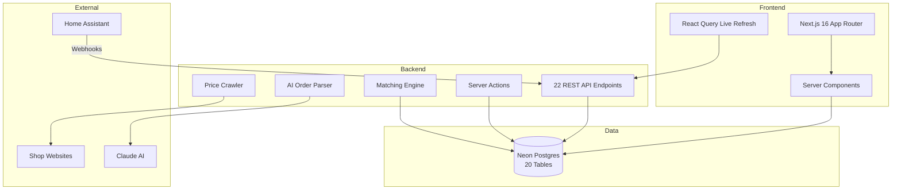

# HASpoolManager

> 3D Printing Filament Lifecycle Manager — from purchase to print, every gram tracked.

[](https://github.com/kbarthei/HASpoolManager/actions)
[](#testing)
[](https://haspoolmanager.vercel.app)
[](LICENSE)

**[Live Demo](https://haspoolmanager.vercel.app)** — Bambu Lab H2S · AMS + AMS HT · Home Assistant

---

## The Problem

Managing 30+ filament spools across storage, AMS slots, and active prints is chaos.

- Which spool is in which AMS slot right now?
- How much filament is left on each spool?
- What did that last print actually cost?
- Which materials are running low and need reordering?

Spoolman covers inventory. It doesn't cover the full picture.

---

## The Solution

HASpoolManager covers the complete filament lifecycle end-to-end:

**Purchase → Store → Load → Print → Track → Reorder**

A modern web app built for the printer bench — dense layout, fast on mobile, dark-mode first — with deep Home Assistant integration for automatic weight deduction after every print.

---

## Key Features

### 🎯 Smart Spool Matching
- **RFID exact match** for Bambu Lab spools with embedded tags
- **CIE Delta-E color distance** matching for third-party spools
- **Bambu filament index** cross-reference
- Confidence scoring across all match strategies

### 📦 AI-Powered Order Management
- Paste an order confirmation email — AI extracts every line item automatically
- Price history and per-gram cost comparison across orders
- Live price crawling from shop product pages
- Powered by Anthropic Claude

### 🗄️ Digital Twin Storage Rack
- Configurable grid (4×8 default) mirrors your physical rack exactly
- Drag & drop between rack positions
- Surplus pile and workbench overflow areas
- Archive mode for empty spools

### 🖨️ AMS Integration
- Real-time slot status for AMS, AMS HT, and external spool
- Load/unload spools with the matching engine
- Live refresh every 30 seconds via React Query
- Slot history and swap tracking

### 📊 Dashboard
- At-a-glance: active spools, printer status, costs, low stock alerts
- Filament summary by vendor and material type
- Recent prints with per-print cost breakdown
- Reorder threshold alerts

### 🏠 Home Assistant Integration
- Webhook-based event system — no polling required
- Print lifecycle events: started → filament changed → finished
- Automatic weight deduction and cost calculation per print
- Full offline fallback for when HA is unreachable

---

## Architecture



### By the Numbers

| Metric | Count |
|--------|-------|
| TypeScript lines | 11,895 |
| React components | 47 |
| API endpoints | 22 |
| Database tables | 20 |
| Unit tests | 154 |
| E2E test specs | 30+ |

---

## Quick Start

### Prerequisites

- Node.js 22+
- [Neon Postgres](https://neon.tech) database (free tier works)
- Vercel account (for deployment)

### Local Setup

```bash
git clone https://github.com/kbarthei/HASpoolManager.git
cd HASpoolManager
npm install
cp .env.example .env.local
# Edit .env.local — set DATABASE_URL and API_SECRET_KEY
npm run db:migrate
npm run dev
```

Open [http://localhost:3000](http://localhost:3000).

### Deploy to Vercel

```bash
npm i -g vercel
vercel link
vercel env pull
vercel --prod
```

---

## Documentation

| Document | Description |
|----------|-------------|
| [Architecture Overview](docs/architecture/overview.md) | System design, data flow, tech decisions |
| [Data Model](docs/architecture/data-model.md) | ER diagram, all 20 tables explained |
| [API Reference](docs/architecture/api-reference.md) | All 22 endpoints with examples |
| [Getting Started](docs/guides/getting-started.md) | 5-minute setup guide |
| [Deployment](docs/guides/deployment.md) | Vercel deployment & configuration |
| [Procurement Workflow](docs/user-stories/procurement.md) | Order → Receive → Store |
| [Printing Workflow](docs/user-stories/printing.md) | AMS → Print → Cost Tracking |
| [Spool Management](docs/user-stories/spool-management.md) | Rack, surplus, workbench, archive |
| [Contributing](CONTRIBUTING.md) | Development setup & PR process |

---

## Tech Stack

| Layer | Technology |
|-------|-----------|
| Framework | Next.js 16 (App Router, Server Components) |
| UI | shadcn/ui, Tailwind CSS v4, Geist fonts |
| Database | Neon Postgres, Drizzle ORM |
| Hosting | Vercel (Frankfurt region) |
| AI | Anthropic Claude (order parsing) |
| Testing | Vitest (154 unit tests), Playwright (30+ e2e specs) |
| CI/CD | GitHub Actions, Vercel auto-deploy |
| Monitoring | Sentry (error tracking) |

---

## Development Commands

```bash
npm run dev          # Start dev server (Turbopack)
npm run build        # Production build
npm run test         # Run Vitest unit tests
npm run test:e2e     # Run Playwright e2e tests
npm run db:push      # Push schema to Neon (dev)
npm run db:migrate   # Run migrations
npm run db:studio    # Open Drizzle Studio
```

---

## Testing

```
Vitest unit tests:     154 passing
Playwright e2e specs:  30+
```

Unit tests cover matching engine logic, API route validation (Zod schemas), cost calculation, and data transformation utilities. Playwright e2e tests cover the full user flows: order creation, rack management, AMS loading, and print tracking.

---

## Design

Apple Health-inspired interface with a teal accent color, full light + dark mode (system preference), and a dense layout optimized for use at the printer. Built mobile-first — the most-used views (AMS slots, rack, dashboard) are thumb-friendly at 390px width.

---

## License

MIT — see [LICENSE](LICENSE).

---

Built with [Claude Code](https://claude.ai/code) by [@kbarthei](https://github.com/kbarthei)
