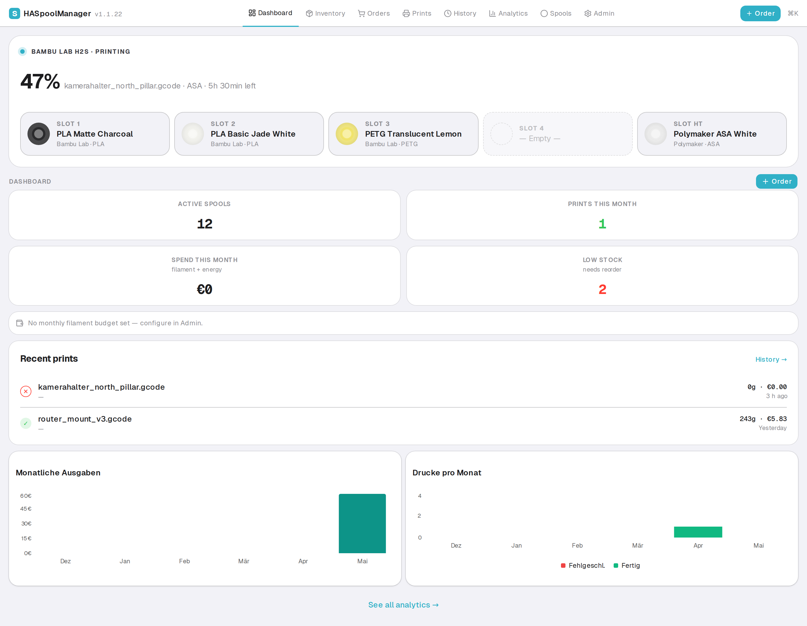
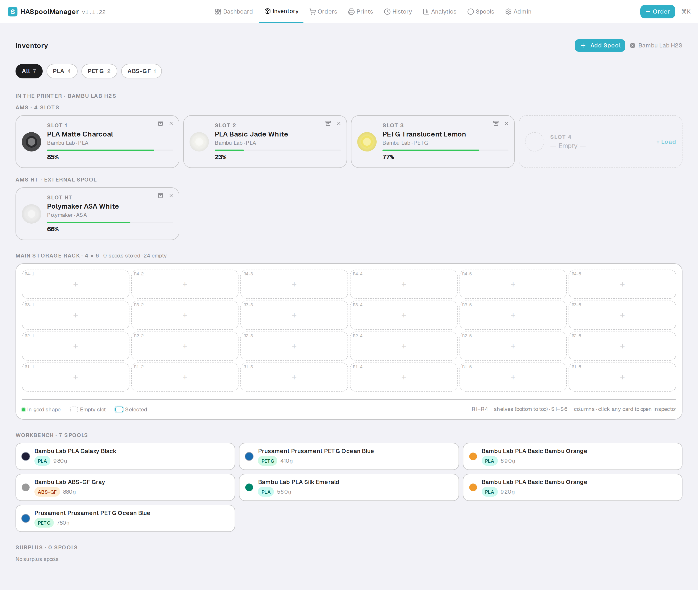
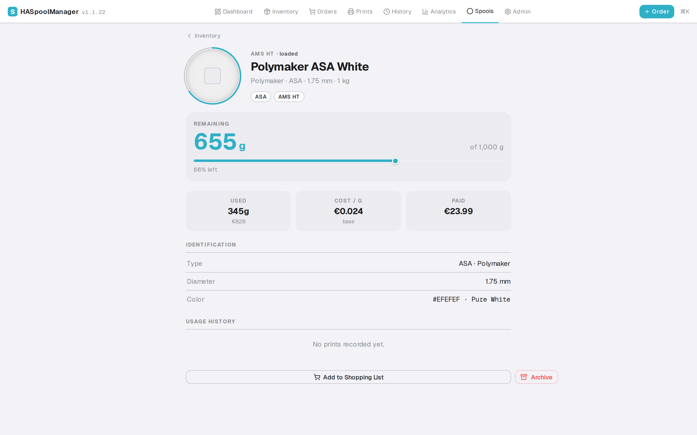

# HASpoolManager

> 3D Printing Filament Lifecycle Manager — from purchase to print, every gram tracked.

[](https://github.com/kbarthei/HASpoolManager/actions)
[](LICENSE)

[![Add repository on my Home Assistant][repository-badge]][repository-url]

[repository-badge]: https://img.shields.io/badge/Add%20repository%20to%20my-Home%20Assistant-41BDF5?logo=home-assistant&style=for-the-badge
[repository-url]: https://my.home-assistant.io/redirect/supervisor_add_addon_repository/?repository_url=https%3A%2F%2Fgithub.com%2Fkbarthei%2Fhaspoolmanager-addon

---

## Installation

1. Click the **"Add repository"** button above, or manually add this URL in your HA Add-on Store:
   ```
   https://github.com/kbarthei/haspoolmanager-addon
   ```
2. Find **HASpoolManager** in the store and click **Install**
3. Start the addon — it auto-discovers your Bambu Lab printer, no configuration needed
4. Optional: Open `http://homeassistant:3001` in Safari → Share → **Add to Home Screen** for a native PWA experience

---

## Overview

HASpoolManager is a self-hosted Home Assistant addon for Bambu Lab printer setups. It manages the complete filament lifecycle — from ordering new spools to tracking per-print costs — across 30+ spools with RFID exact matching for Bambu filaments and CIE Delta-E color-distance fuzzy matching for third-party brands. The mobile-first UI is designed for use at the printer, with direct PWA access on port 3001.

**Purchase → Inventory → Storage → AMS Loading → Print Tracking → Usage Deduction → Cost Analytics**



The Inventory page mirrors your physical setup — AMS slots on top, rack grid below, workbench + surplus as flat lists:



Click any spool to drill into its full lifecycle — remaining weight, cost-per-gram, usage history, location:



Screenshots are auto-refreshed weekly from a deterministic e2e harness — see [`docs/screenshots/`](docs/screenshots/) for the full set (dark + light × desktop + mobile).

---

## Key Features

| Feature | Description |
|---|---|
| **Zero-Config Sync** | Auto-discovers printers via HA websocket — no YAML, no rest_command, no automations needed |
| **AI Order Parsing** | Paste an order confirmation email — Claude extracts filament line items, quantities, unit prices, and shops automatically |
| **Smart Inventory** | Multi-rack + multi-AMS support with drag-and-drop placement, brand/material chips, and a digital twin of every shelf |
| **AMS Integration** | Real-time slot status for AMS (4-slot) and AMS HT (1-slot); RFID exact match plus CIE Delta-E fuzzy matching |
| **AMS Drying Status** | Track drying state per AMS unit with automatic status updates |
| **Per-Tray Weight Tracking** | 3MF-based per-tray weight consumption for accurate usage tracking |
| **Mid-Print Spool Swap Detection** | Automatically detects and handles spool swaps during active prints; oscillation guard prevents duplicate-draft spawns from non-RFID color drift |
| **Cover-Image + Camera Snapshot** | Captures the slicer's cover preview at print start (event-driven, race-resistant) and a camera snapshot at end |
| **Cost Analytics** | Per-print filament + energy costs, per-gram price history, shopping list with live price crawling |
| **Live Watchdog Polling** | Active prints poll every 30 s for progress + remaining-time so the dashboard never goes stale |
| **Diagnostics + Self-Heal** | `/admin/diagnostics` surfaces 8 live detectors plus orphan-photo cleanup, all one click away from the affected records |
| **Full Lifecycle** | Order, receive, store, load, print, track, archive — with confidence-scored spool matching at every step |
| **Home Assistant Addon** | Native HA websocket sync worker with auto-discovered entities (German + English `original_name` mapping) |
| **Apple Health Design** | Clean light/dark UI with teal accent, Geist fonts, dense mobile-first layout optimized for use at the printer |

---

## Architecture


---

## Tech Stack

| Layer | Technology |
|-------|-----------|
| Frontend | Next.js 16 (App Router, Server Components, Turbopack) |
| UI | shadcn/ui, Tailwind CSS v4, Geist fonts, Recharts |
| Backend | Next.js API Routes, Server Actions, Zod validation |
| Database | SQLite (better-sqlite3), Drizzle ORM |
| AI | Anthropic Claude (order parsing, price extraction) |
| Hosting | Home Assistant addon (Docker: Alpine + nginx + Next.js standalone) |
| Auth | Bearer API key (HA integration), web UI via HA ingress, direct PWA on port 3001 |
| Testing | Vitest (unit + integration with SQLite harness), Playwright (e2e) |
| CI/CD | GitHub Actions, `./ha-addon/deploy.sh` for addon deploys |

---

## Quick Start

### Prerequisites

- Node.js 22+
- Home Assistant instance with SSH access (for addon deployment)
- Anthropic API key (for AI order parsing)

### Local Development

```bash
git clone https://github.com/kbarthei/HASpoolManager.git
cd HASpoolManager
npm install
cp .env.example .env.local
# Edit .env.local — set API_SECRET_KEY and ANTHROPIC_API_KEY
npm run db:push
npm run dev
```

Open [http://localhost:3000](http://localhost:3000).

### Deploy to Home Assistant

```bash
./ha-addon/deploy.sh     # bumps version, builds tar, scp + install on HA
```

Requires SSH key auth to `root@homeassistant` and a writable `/addons/` directory on the HA host.

### PWA Install

After deploying the addon, open `http://<ha-host>:3001` on your phone and add to home screen for a native app experience at the printer.

### Commands

```bash
npm run dev                # Dev server (Turbopack)
npm run build              # Production build
npm run test:unit          # Unit tests (no DB needed)
npm run test:integration   # Integration tests (per-worker SQLite)
npm run test:e2e           # E2e tests (Docker nginx + ingress simulator)
npm run db:push            # Push schema to local SQLite
npm run db:studio          # Drizzle Studio
./ha-addon/deploy.sh       # Build + deploy to HA
```

---

## Documentation

| Document | Description |
|----------|-------------|
| [Docs index](docs/README.md) | Entry point for all documentation |
| [Architecture](docs/architecture/overview.md) | System design, data flow, tech decisions |
| [Installation](docs/operator/installation.md) | Installation and setup guide |
| [Configuration](docs/operator/configuration.md) | Configuration reference |
| [API Reference](docs/reference/api.md) | All API endpoints with request/response examples |
| [Testing](docs/development/testing.md) | Test pyramid, CI pipeline, spec catalogue |
| [User Stories](docs/user-stories/) | Procurement, printing, and spool management workflows |

---

## Testing

| Level | Tests | Files |
|-------|------:|------:|
| Unit | 537 | 22 |
| Integration | 186 | 22 |
| E2e | ~50 | 18 |
| **Total** | **~773** | **62** |

Unit tests cover the spool matching engine (RFID, CIE Delta-E, fuzzy), API route validation (Zod schemas), cost calculation, and data transformation utilities. Integration tests call route handlers directly against a per-worker SQLite harness — including a **browser auth contract** test that asserts every browser-callable route accepts no-Bearer requests. E2e tests run against the full addon stack: Next.js standalone, Docker nginx with production config, and a Node.js ingress simulator.

**CI pipeline:** lint + typecheck + unit + integration on every PR; e2e on main push. Screenshots are regenerated weekly via `.github/workflows/screenshots.yml` and committed back to `docs/screenshots/`.

---

## License

MIT — see [LICENSE](LICENSE).

---

Built with [Claude Code](https://claude.ai/code) by [@kbarthei](https://github.com/kbarthei)
