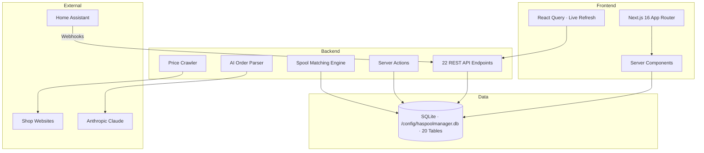

# HASpoolManager

> 3D Printing Filament Lifecycle Manager — from purchase to print, every gram tracked.

[](https://github.com/kbarthei/HASpoolManager/actions)
[](LICENSE)

Home Assistant addon · Bambu Lab H2S · AMS + AMS HT · SQLite · Next.js 16

---

## What is HASpoolManager?

HASpoolManager is a modern web application that replaces Spoolman for Bambu Lab printer setups — covering the complete filament journey from first purchase to final print. It tracks 30+ spools across physical storage, AMS slots, and active prints; automatically deducts filament weight after each job via Home Assistant webhooks; parses order confirmation emails with AI to log new stock in seconds; and surfaces per-print costs, price history, and reorder alerts in a dense, mobile-first UI built for use at the printer.

**Purchase → Inventory → Storage → AMS Loading → Print Tracking → Usage Deduction → Cost Analytics → Reorder Alerts**

---

## Key Features

| | Feature | Description |
|---|---|---|
| 🎯 | **AI-Powered Order Parsing** | Paste an order confirmation email — Claude extracts every filament line item, quantity, unit price, and shop automatically |
| 📦 | **Smart Inventory** | Track 30+ spools across rack, AMS, surplus pile, and workbench with full lifecycle state machine |
| 🖨️ | **AMS Integration** | Real-time slot status for AMS, AMS HT, and external spool; RFID exact match + CIE Delta-E color distance fuzzy matching |
| 📊 | **Cost Tracking** | Per-print filament costs, per-gram price history, shopping list with live price crawling from shop product pages |
| 🏗️ | **Digital Rack Twin** | Configurable 4×8 grid mirrors your physical spool rack exactly — drag & drop positions, overflow areas, archive mode |
| 🔄 | **Full Lifecycle** | Order → Receive → Store → Load → Print → Track → Archive with confidence-scored spool matching at every step |
| 🏠 | **Home Assistant Ready** | Webhook-based event system — print started/filament changed/finished — automatic weight deduction, no polling required |
| 🌗 | **Apple Health Design** | Clean light/dark UI with teal accent, Geist fonts, dense mobile-first layout optimized for thumb use at the printer |

---

## Screenshots

<!-- TODO: Add screenshots once stable UI is finalized -->
<!-- Planned captures:
  - Dashboard: stats summary, AMS mini view, low stock alerts, recent print costs
  - Spool inventory: grid and list views with filter/sort controls
  - Storage rack: 4×8 digital twin with drag & drop
  - Order parser: AI extraction flow from email paste to confirmed line items
-->

---

## Architecture



### By the Numbers

| Metric | Count |
|--------|-------|
| TypeScript lines | ~12,000 |
| React components | 47 |
| API endpoints | 22 |
| Database tables | 20 |
| Unit tests | 154 |
| E2E test specs | 30+ |
| Smoke tests | 11 |

---

## Tech Stack

| Layer | Technology |
|-------|-----------|
| Frontend | Next.js 16 (App Router, Server Components, Turbopack) |
| UI | shadcn/ui, Tailwind CSS v4, Geist fonts, Recharts |
| Backend | Next.js API Routes, Server Actions, Zod validation |
| Database | SQLite (better-sqlite3), Drizzle ORM |
| AI | Anthropic Claude (order parsing, price extraction) |
| Hosting | Home Assistant Add-on (local, self-hosted) |
| Auth | Bearer API key (HA integration + web UI via HA ingress) |
| Monitoring | Sentry (error tracking) |
| Testing | Vitest (unit + integration w/ SQLite harness), Playwright (e2e) |
| CI/CD | GitHub Actions, `./ha-addon/deploy.sh` for addon deploys |

---

## Quick Start

### Prerequisites

- Node.js 22+
- A Home Assistant instance with SSH access (for deploying the addon)
- Anthropic API key (for AI order parsing)

### Local Setup

```bash
git clone https://github.com/kbarthei/HASpoolManager.git
cd HASpoolManager
npm install
cp .env.example .env.local
# Edit .env.local — set API_SECRET_KEY and ANTHROPIC_API_KEY
#   SQLITE_PATH defaults to ./data/haspoolmanager.db
npm run db:push          # Apply schema to local SQLite file
npm run dev
```

Open [http://localhost:3000](http://localhost:3000).

### Deploy to Home Assistant

The production target is the HA addon container (SQLite + nginx + Next.js).
Deploy via:

```bash
./ha-addon/deploy.sh     # bumps version, builds tar, scp + install on HA
```

This requires SSH key auth to `root@homeassistant` and assumes `/addons/`
is writable on the HA host.

### Development Commands

```bash
npm run dev                # Start dev server (Turbopack)
npm run build              # Production build
npm run test:unit          # Vitest unit tests (no DB needed)
npm run test:integration   # Vitest integration tests (per-worker SQLite harness)
npm run test:e2e           # Playwright e2e tests
npm run db:push            # Push schema changes to local SQLite
npm run db:studio          # Open Drizzle Studio
```

---

## Documentation

| Document | Description |
|----------|-------------|
| [Architecture Overview](docs/architecture/overview.md) | System design, data flow, tech decisions |
| [Data Model](docs/architecture/data-model.md) | ER diagram and all 20 tables explained |
| [API Reference](docs/architecture/api-reference.md) | All 22 endpoints with request/response examples |
| [Getting Started](docs/guides/getting-started.md) | 5-minute setup guide |
| [Deployment](docs/guides/deployment.md) | Vercel deployment & environment configuration |
| [Procurement Workflow](docs/user-stories/procurement.md) | Order → Receive → Store |
| [Printing Workflow](docs/user-stories/printing.md) | AMS → Print → Cost Tracking |
| [Spool Management](docs/user-stories/spool-management.md) | Rack, surplus, workbench, archive |
| [Contributing](CONTRIBUTING.md) | Development setup & PR process |

---

## Testing

```
Vitest unit tests:     154 passing
Playwright e2e specs:  30+
Smoke tests:           11
```

Unit tests cover the spool matching engine (RFID, CIE Delta-E, fuzzy), API route validation (Zod schemas), cost calculation, and data transformation utilities. Playwright e2e tests cover full user flows: order creation, rack management, AMS loading, and print tracking. Smoke tests verify critical API endpoints on every deploy.

---

## Project Status

Actively developed as a personal tool replacing Spoolman for a Bambu Lab H2S setup (AMS 4-slot + AMS HT 1-slot) with 30+ filament spools managed via Home Assistant.

---

## License

MIT — see [LICENSE](LICENSE).

---

Built with [Claude Code](https://claude.ai/code) by [@kbarthei](https://github.com/kbarthei) · Deployed on [Vercel](https://vercel.com)
