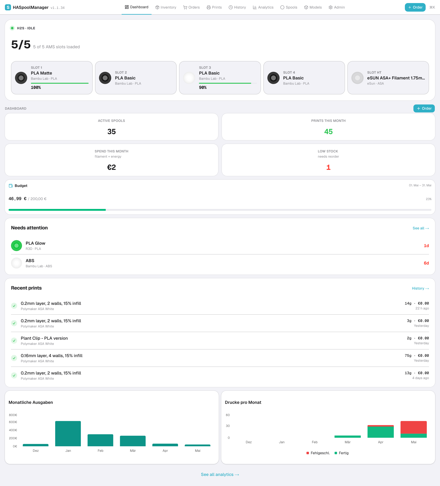
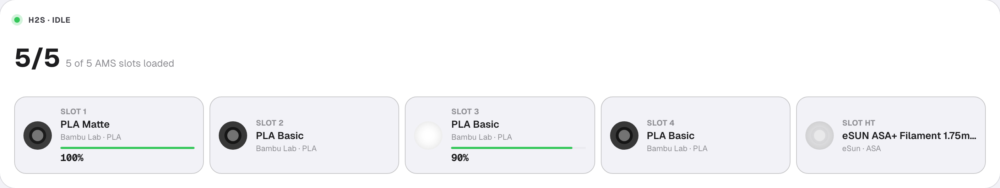
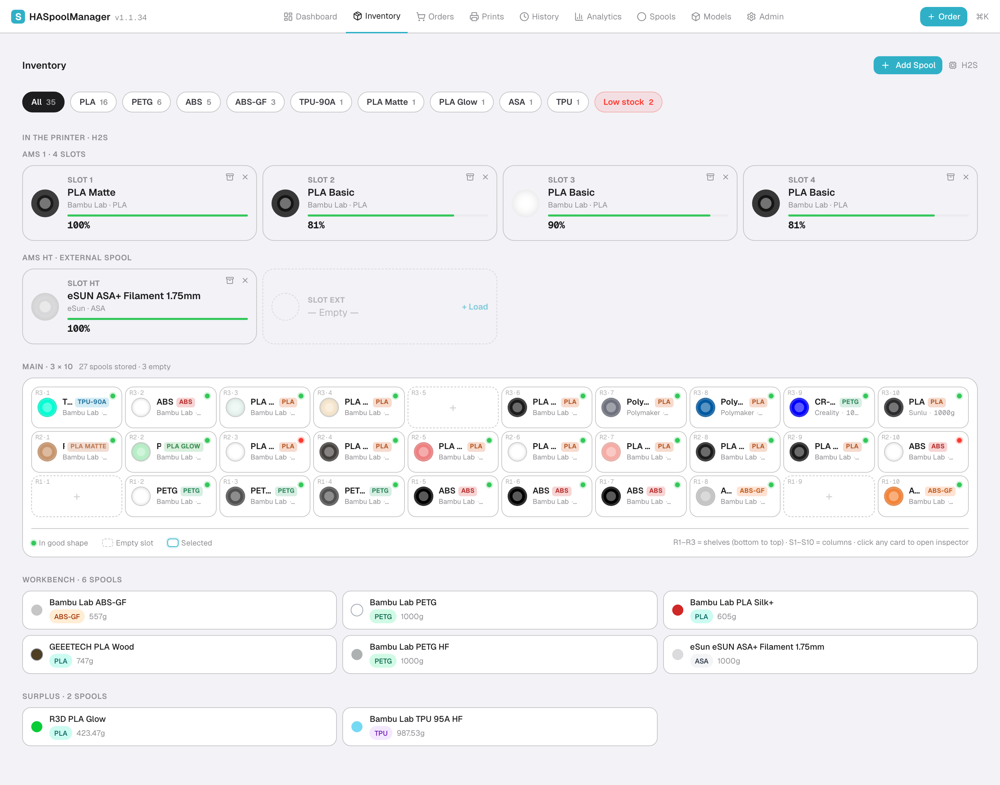
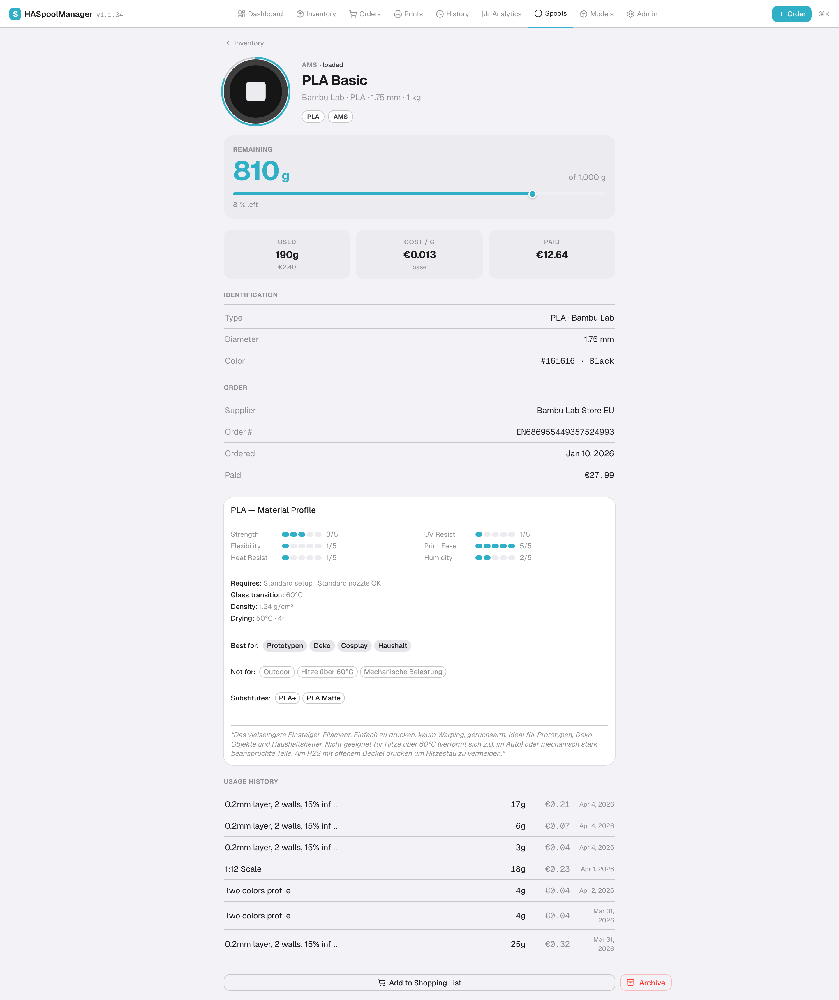
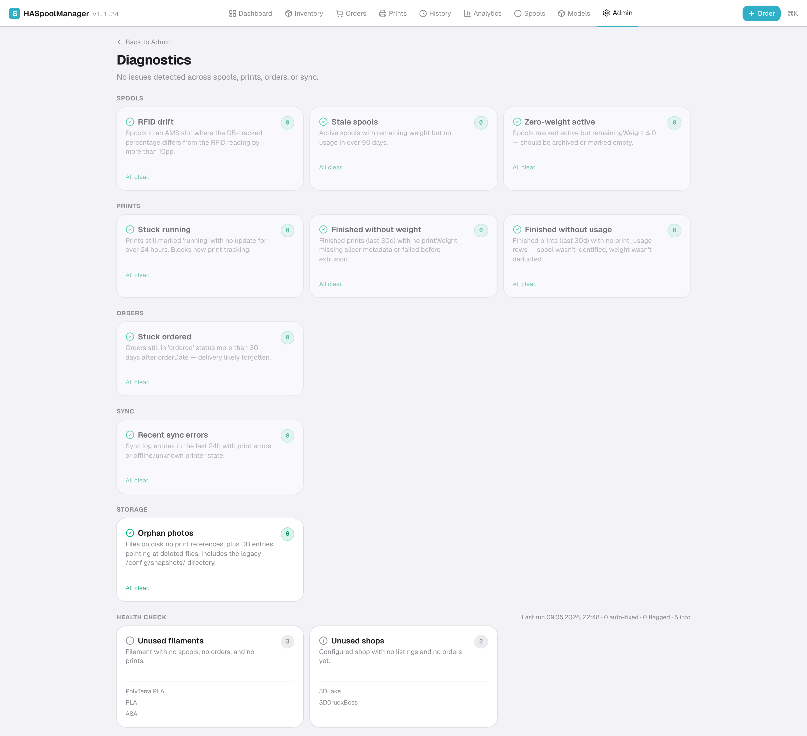
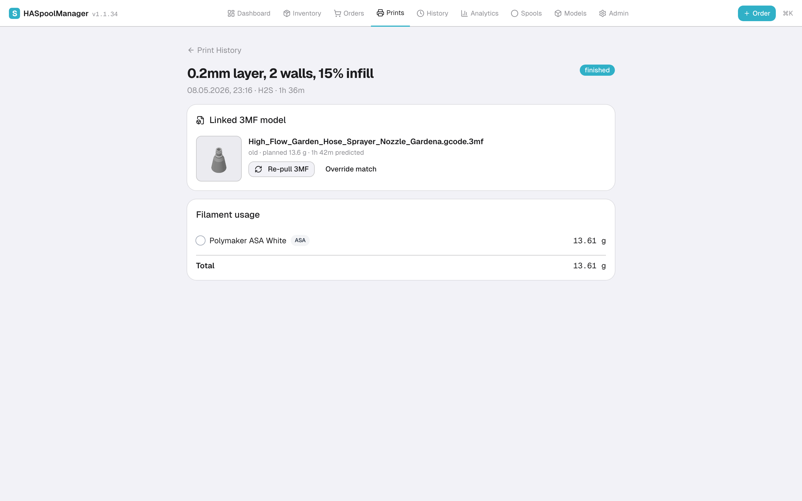
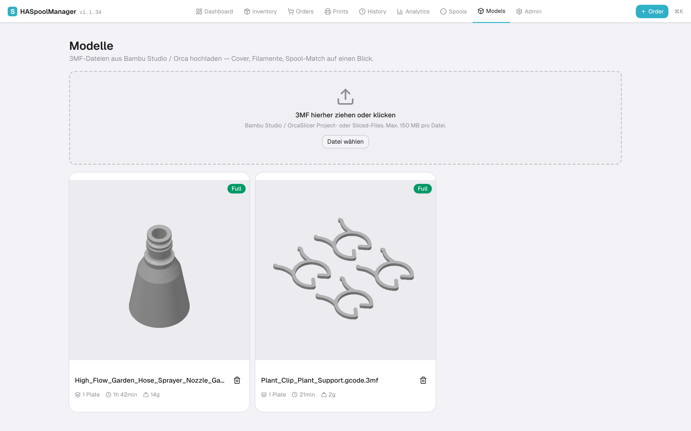
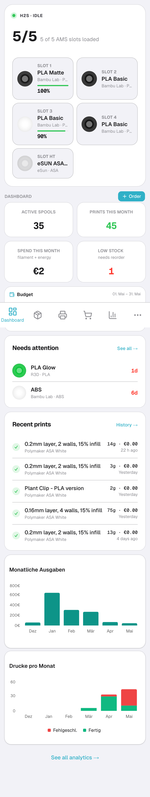
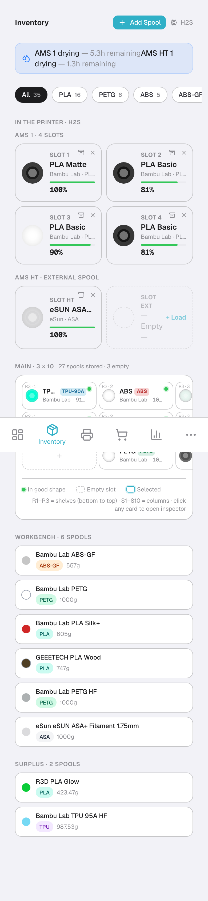
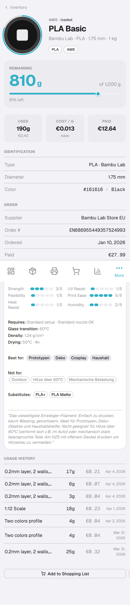

# HASpoolManager

> **Track every gram of filament from order confirmation to finished print.**
> Native Home Assistant addon for Bambu Lab printers — no rest-commands, no YAML,
> no cloud account. Your data stays on your HA host.

[](https://github.com/kbarthei/HASpoolManager/actions)
[](LICENSE)

[![Add repository on my Home Assistant][repository-badge]][repository-url]

[repository-badge]: https://img.shields.io/badge/Add%20repository%20to%20my-Home%20Assistant-41BDF5?logo=home-assistant&style=for-the-badge
[repository-url]: https://my.home-assistant.io/redirect/supervisor_add_addon_repository/?repository_url=https%3A%2F%2Fgithub.com%2Fkbarthei%2Fhaspoolmanager-addon



🎬 **[100-second product demo](screenshots/demo.mp4)** ([9:16 vertical](screenshots/demo-vertical.mp4)) · 📸 **[Full screenshot tour](screenshots/)** (light + dark, desktop + mobile) · 🎥 **[30-second walkthrough](screenshots/walkthrough.webm)** (live UI nav)

---

## What you get

You order a spool → email confirms it → addon parses the email and adds the
spool to your inventory. You insert it into your AMS → RFID auto-recognises
it. You start a print → 3MF metadata is pulled from the printer cache, the
slicer's cover image becomes your thumbnail, and remaining weight is
deducted live. The print finishes → cost is calculated from filament + power
consumption.

**No spreadsheet. No "Spool Manager" tab in OctoPrint that you forgot to
update three months ago. No cloud account.**

| | |
|---|---|
| 🎯 **Zero-config Bambu** | Auto-discovers your printer via HA websocket. RFID exact-match for Bambu spools, CIE Delta-E fuzzy match for everything else. Multi-AMS + AMS HT supported. |
| 📥 **AI order parsing** | Paste a Bambu / Polymaker / Amazon order email. Claude extracts line items, quantities, unit prices, and shop. Auto-creates pending spools. |
| 🔍 **3MF metadata pull** | When you click "Send to Printer" in Bambu Studio, the addon FTPs the sliced 3MF from the printer cache, parses cover + filament list + weight estimate, and links it to the running print. |
| 📊 **Per-print cost analytics** | Filament cost (per gram, with tare-weight calibration) + electricity (HA smart-plug integration) per print. Per-vendor reliability score from HMS errors. |
| 🏗️ **Multi-rack inventory** | Digital twin of your physical storage — racks, AMS slots, workbench, surplus. Drag-and-drop placement, filter chips by brand/material/color. |
| 🛒 **Smart reorder** | Threshold-based supply rules → shopping list with live price crawling across Bambu Lab DE, Polymaker, etc. "Optimised cart" minimises shipping cost. |
| 🩺 **Diagnostics dashboard** | 8 live detectors (RFID drift, stale spools, stuck prints, missing weights, sync errors, orphan photos…) with one-click deep links to fix. |
| 🔐 **SQL audit log** | Every admin SQL operation logged with user, timing, rows affected. Browser-based SQL runner with read/write modes + dry-run. |
| 📱 **PWA at the printer** | Mobile-first responsive UI. Add to home screen for a native app feel — bottom tab bar, large touch targets, dense data layout. |

---

## See it in action

**Live printer hero on the dashboard** — RFID-resolved names, remaining %, idle/printing state, all from one HA websocket subscription:



**Inventory page** — physical layout: AMS slots on top, rack grid in the middle, workbench + surplus as flat lists. Filter chips + drag-drop:



**Spool Inspector** — full lifecycle for any spool: remaining, cost-per-gram, usage history, location, vendor links, calibration data:



**Diagnostics dashboard** — eight detectors that find data drift before you do:



**3MF metadata pull** — Bambu Studio "Send to Printer" → addon FTPs the sliced project from the printer cache, parses cover + filament plan, and links it to the running print:



The Models tab keeps a deduped library of every 3MF the addon has ever pulled (or you've drag-dropped). Each card cross-links to every print that used it — and back the other way:



**Mobile PWA** — at the printer in your hand:

  

---

## Why not Spoolman / SimplyPrint / your own spreadsheet?

| | HASpoolManager | Spoolman | SimplyPrint | DIY spreadsheet |
|---|:-:|:-:|:-:|:-:|
| Native HA integration | ✅ Addon, zero-config | ❌ Separate Docker container | ❌ Cloud SaaS | ❌ |
| Bambu RFID auto-match | ✅ Out of the box | ⚠️ Manual link | ⚠️ Beta | ❌ |
| AI order parsing | ✅ Claude-powered | ❌ | ❌ | ❌ |
| Per-tray weight tracking | ✅ from 3MF + MQTT | ❌ | ✅ | ❌ |
| AMS humidity tracking | ✅ via MQTT | ❌ | ⚠️ | ❌ |
| Cost analytics (€ per print) | ✅ Filament + electricity | ⚠️ Filament only | ✅ | DIY |
| HMS error → vendor reliability | ✅ Auto-correlated | ❌ | ❌ | ❌ |
| Cloud account required | ❌ Self-hosted | ❌ | ✅ | ❌ |
| Your data privacy | 💯 SQLite on your HA | 💯 Self-hosted | ⚠️ Cloud | 💯 |

If you already have a Bambu Lab printer + Home Assistant + frustration with
"why don't my filament records match reality" → this is built for you.

---

## Installation

> **Prerequisites:** Home Assistant OS or Supervised, Bambu Lab printer
> already paired with HA (via the official `ha-bambulab` integration).

**1.** Click below to add the addon repository to your HA:

[![Add repository on my Home Assistant][repository-badge]][repository-url]

Or paste manually in **Settings → Add-ons → Add-on Store → ⋮ → Repositories**:
```
https://github.com/kbarthei/haspoolmanager-addon
```

**2.** Find **HASpoolManager** in the store → **Install** → **Start**.

**3.** Open the **Web UI** button. The addon auto-discovers your printer
   from HA's device registry — no configuration files to write.

**4.** *(Optional, recommended)* On your phone, open `http://homeassistant.local:3001`
   in Safari → Share → **Add to Home Screen**. Now you have a native PWA at
   the printer with one tap.

---

## Your first hour

Install takes ~5 minutes. The next ~55 minutes are the most important — that's
where the addon learns about your inventory and starts being useful.

### Hour 0–10 min — Verify the printer connection

- Open the Dashboard. The **Printer hero card** should show your printer's
  current state: idle, AMS slots populated with the Bambu names from RFID.
- If it shows `entity_picture: null` for the cover — that's fine, Bambu only
  pushes covers when a print is actively running. Try sending a test print.

### Hour 10–30 min — Seed your inventory

Three ways to get spools into the database:

1. **Already have spools loaded in AMS?** They auto-appear within 30s of
   addon start. Check Dashboard → Printer hero. Each AMS-loaded spool gets a
   `draft` row that you confirm/edit on the Spool Inspector.
2. **Have order confirmation emails?** Go to **Orders → Paste Email**.
   Drop in any Bambu Lab / Polymaker / Amazon Marketplace order email →
   Claude extracts the line items → click "Receive Order" to materialise spools.
3. **Manual entry?** Use **Spools → Add Spool** with the catalogue picker —
   300+ vendors with pre-filled density, temps, and color hex.

For third-party (non-Bambu) spools, scan the NFC sticker (we recommend
NTAG213/215 — see [`docs/operator/configuration.md`](docs/operator/configuration.md))
and the addon will associate the tag UID with the spool record. Next time
you load that spool in AMS, the addon recognises it via the cached tag.

### Hour 30–45 min — Trigger your first print

Send any small print from Bambu Studio. Within 30s you should see:
- Dashboard shows the print in **Currently Printing** with cover image, layer
  progress, and remaining-time
- After 30s the addon auto-pulls the source 3MF from the printer cache via
  FTPS (set the printer's Access Code in **Admin → Bambu Access Code** first)
- When the print finishes, **Prints** page shows weight used per spool, cost,
  and the camera snapshot

### Hour 45–60 min — Set supply rules

Go to **Orders → Supply Rules**. Set "minimum 1 spool active" for each
Material × Color you regularly use. The Shopping List card now shows what
to reorder, the Optimised Cart suggests the cheapest combination across
your configured shops.

If you have an HA smart plug on your printer, configure it under
**Admin → Energy Tracking** so per-print electricity cost shows alongside
filament cost.

---

## FAQ

**Does this work without internet?**
Yes. Once installed, all features except AI order parsing and price crawling
work fully offline. The sync worker talks to your local HA instance; nothing
leaves your network.

**Does this work with non-Bambu printers?**
The HA integration is Bambu-specific (uses `ha-bambulab` events). For other
printers you can manually create spools, track prints, and use cost
analytics — but you lose the AMS auto-sync magic.

**What happens to my data if I uninstall the addon?**
The SQLite database stays at `/config/haspoolmanager.db` on your HA host.
Backups (gzipped daily) live at `/config/haspoolmanager/backups/`. Reinstall
restores everything.

**Is there a cloud version?**
No, by design. Everything runs in your HA addon container. Even the AI order
parsing makes a single outbound HTTPS call to Anthropic with the email text
only — no spool data leaves your host.

**Can I run this without Home Assistant?**
The addon expects HA's environment (Supervisor token, ingress proxy). For a
non-HA self-host you'd need to extract the Next.js app and recreate the
sync worker's HA-websocket connection — possible but unsupported.

**Where do I file bugs / feature requests?**
[GitHub Issues](https://github.com/kbarthei/HASpoolManager/issues). Include
your addon version (visible in the top-left header) and any relevant
`/admin` diagnostics card output.

**How is this maintained?**
By one person (the maintainer's own H2S setup is the reference deployment).
Releases happen when features are ready, not on a schedule. CI is green on
every push to `main`. ~880 tests, ~50 e2e specs.

---

## Documentation

| Document | Description |
|----------|-------------|
| [Docs index](docs/README.md) | Full documentation tree |
| [User Guide](docs/operator/user-guide.md) | Day-to-day workflows |
| [Operations Runbook](docs/operator/operations-runbook.md) | Break-fix recipes |
| [Configuration](docs/operator/configuration.md) | All config options |
| [Architecture](docs/architecture/overview.md) | System design + data flow |
| [API Reference](docs/reference/api.md) | Every `/api/v1/*` endpoint |

---

## For developers

**Tech stack** — Next.js 16 (App Router, Turbopack) · shadcn/ui + Tailwind v4 ·
SQLite + Drizzle ORM · Vitest + Playwright · Anthropic Claude (AI parser).

**Local dev:**
```bash
git clone https://github.com/kbarthei/HASpoolManager.git
cd HASpoolManager
npm install
cp .env.example .env.local                  # set API_SECRET_KEY etc
# Restore a real-data snapshot (see docs/development/getting-started.md §3)
cp testdata/db-snapshots/prod-*.db data/haspoolmanager.db
node scripts/migrate-db.js
npm run dev                                 # http://localhost:3000
```

**Test suite — currently green at 936 tests:**
| Layer | Tests | Files |
|-------|------:|------:|
| Unit (Vitest, no DB) | 660 | 28 |
| Integration (per-worker SQLite) | 226 | 26 |
| E2e (Docker nginx + Playwright) | ~50 | 18 |

The integration tier includes an auto-discovered **browser-auth-contract**
scanner that fails CI if any new browser-called endpoint uses `requireAuth`
without a Bearer-wrapping client.

Full setup, conventions, and PR workflow in [CONTRIBUTING.md](CONTRIBUTING.md)
and [docs/development/getting-started.md](docs/development/getting-started.md).

**For AI agents:**
- [CLAUDE.md](CLAUDE.md) — feature development conventions
- [BOB.md](BOB.md) — architecture/security review standards

---

## License

MIT — see [LICENSE](LICENSE). Use it, fork it, ship your own version.
