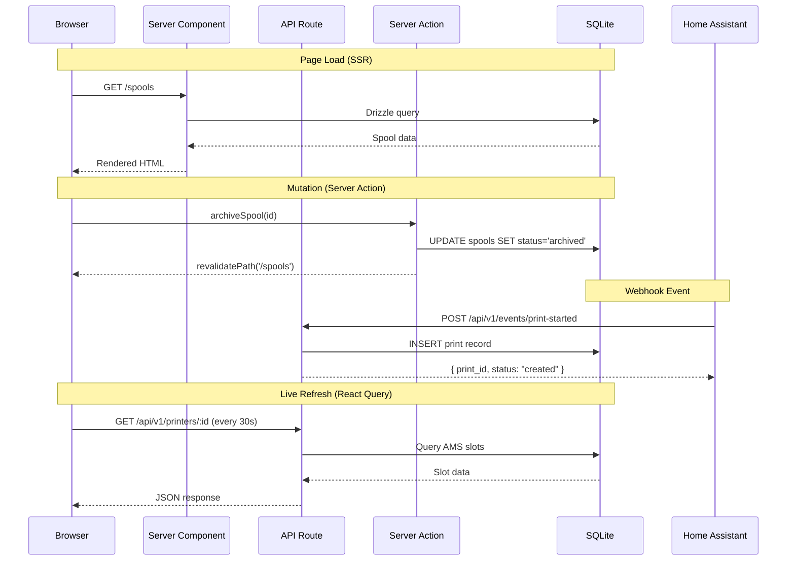
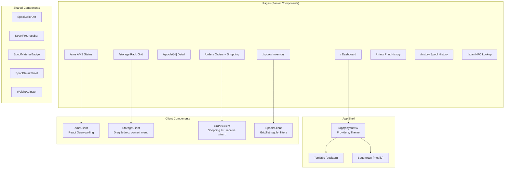
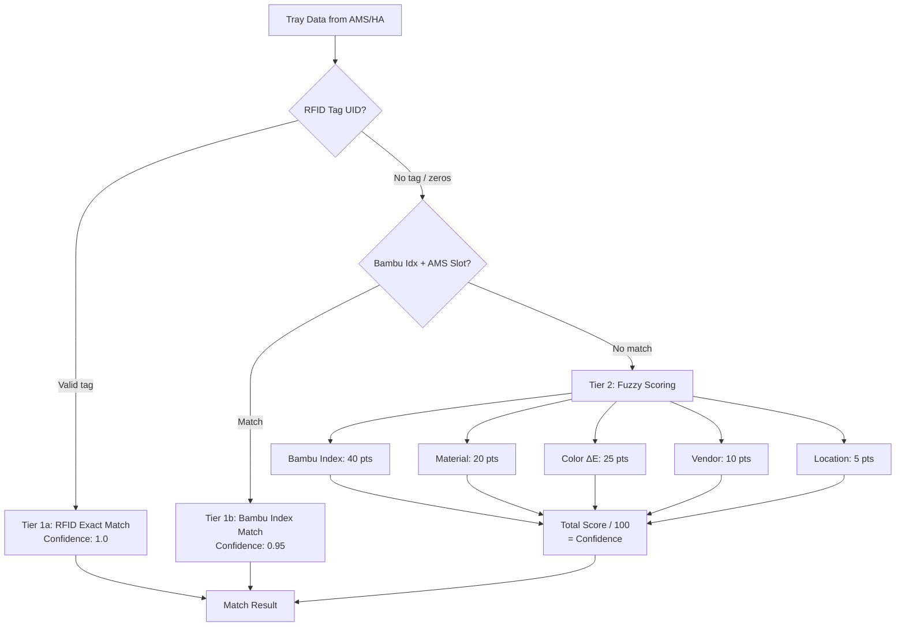

# System Architecture

## 1. System Overview

HASpoolManager is a Next.js 16 application (App Router) that runs as a Home Assistant add-on. It manages the full 3D printing filament lifecycle: purchase, inventory, storage, AMS loading, print tracking, usage deduction, cost analytics, and reorder alerts.

- **Runtime:** Next.js 16 standalone build on Alpine Linux (Docker container)
- **Reverse proxy:** nginx handles ingress routing (port 3000 for HA ingress, port 3001 for direct access)
- **Database:** SQLite at `/config/haspoolmanager.db` (20 tables, managed via Drizzle ORM)
- **Integration:** Native HA websocket sync worker (zero-config, auto-discovers printers, 21 entities mapped)
- **Printer:** Bambu Lab H2S with AMS (4 slots) + AMS HT (1 slot), integrated through HA entities

## 2. Request Flow



## 3. Component Architecture



## 4. Rendering Strategy

| Page | Rendering | Why |
|------|-----------|-----|
| Dashboard | Server Component | Aggregates from multiple tables, no interactivity needed for initial render |
| Spools | Server Component + Client wrapper | Server fetches + filters, client handles view toggle and URL state |
| Spool Detail | Server Component | Static data display, no live updates needed |
| AMS Status | Server Component + React Query | Initial SSR, then polls every 30s for live slot updates |
| Storage | Server Component + Client wrapper | Server fetches rack data, client handles drag & drop |
| Orders | Server Component + Client wrapper | Server fetches orders, client handles shopping list, dialogs |

## 5. Addon Container Architecture

```
┌─────────────────────────────────────────┐
│ HA Addon Container (Alpine Linux)       │
│                                         │
│  run.sh starts:                         │
│    1. migrate-db.js (schema migrations) │
│    2. Next.js standalone (:3002)        │
│    3. sync-worker.js (HA websocket)     │
│    4. nginx (:3000 + :3001)             │
│                                         │
│  nginx (:3000 ingress, :3001 direct)    │
│    ├── /ingress/* → Next.js :3002       │
│    ├── /api/* → Next.js :3002           │
│    └── sub_filter rewrites (ingress)    │
│                                         │
│  Next.js standalone (:3002)             │
│    ├── Server Components (SSR)          │
│    ├── API Routes (/api/v1/*)           │
│    └── Server Actions                   │
│                                         │
│  Sync Worker (HA websocket client)      │
│    ├── Auto-discovers printers via HA   │
│    ├── 21 entities mapped (DE+EN)       │
│    └── Zero-config, no YAML needed      │
│                                         │
│  SQLite (/config/haspoolmanager.db)     │
│    └── 20 tables, Drizzle ORM           │
│    └── Auto-migration on startup        │
└─────────────────────────────────────────┘
```

Port layout:
- **3000** -- HA ingress proxy target. nginx rewrites `/api/hassio/ingress/<token>/` paths and applies `sub_filter` to fix asset URLs in HTML responses.
- **3001** -- Direct access (bypasses ingress). Used for development and direct API calls from HA `rest_command`.
- **3002** -- Internal Next.js standalone server. Never exposed outside the container.

## 6. Spool Matching Engine

Three-tier matching system for identifying spools when AMS tray data arrives from Home Assistant:



- **Tier 1a -- RFID Exact Match (confidence 1.0):** Bambu spools carry RFID tags. When the tag UID matches a spool record, the match is certain.
- **Tier 1b -- Bambu Index Match (confidence 0.95):** If no RFID tag is present but the Bambu tray index and AMS slot combination matches a known spool assignment, a near-certain match is returned.
- **Tier 2 -- Fuzzy Scoring:** For third-party spools without RFID, a weighted scoring algorithm combines Bambu index (40 pts), material type (20 pts), color distance via CIE Delta-E (25 pts), vendor (10 pts), and last-known location (5 pts). The total score divided by 100 becomes the confidence value.

## 7. Data Mutation Pattern

**Server Actions** (`"use server"`) handle all UI-driven mutations:
- Defined in `lib/actions.ts`
- Each action updates SQLite via Drizzle ORM
- Each action calls `revalidatePath()` to refresh affected Server Components
- Client components invoke actions directly (no intermediate API call)

**API Routes** (`/api/v1/*`) serve external consumers:
- Home Assistant webhook integration (print events, AMS sync, weight updates)
- React Query polling endpoints (AMS status, printer state)
- AI-powered order email parsing
- Price crawling

## 8. Security

| Layer | Implementation |
|-------|---------------|
| HTTP Headers | X-Frame-Options, HSTS, nosniff, Referrer-Policy, Permissions-Policy |
| API Auth | Bearer token for HA webhooks (`requireAuth` middleware) |
| Web UI Read | `optionalAuth` -- no token needed for GET requests via HA ingress |
| Input Validation | Zod schemas on all POST routes |
| SQL Injection | Drizzle ORM parameterized queries |
| Error Monitoring | Sentry (when DSN configured) |

## 9. Data Model

The SQLite database contains 20 tables covering vendors, filaments, spools, storage locations, AMS slots, print jobs, usage records, orders, price history, and more.

For full schema details, see:
- [Data Model](architecture/data-model.md) -- table definitions and relationships
- [ER Diagram](er-diagram.md) -- visual entity-relationship diagram
