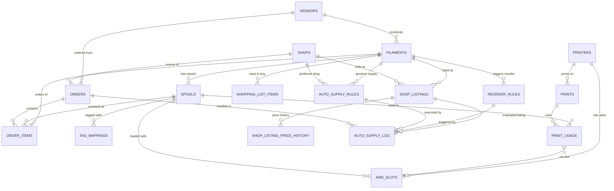

# Data Model

## ER Diagram

---

## Table Groups

### Core

#### `vendors`

Filament manufacturers. Used as the top-level brand in the filament catalog.

| Column | Type | Notes |
|--------|------|-------|
| `id` | uuid PK | |
| `name` | text UNIQUE NOT NULL | e.g. "Bambu Lab", "Polymaker" |
| `website` | text | |
| `country` | text | |
| `logo_url` | text | |
| `bambu_prefix` | text | Prefix used in Bambu filament codes to identify vendor |
| `notes` | text | |
| `created_at` / `updated_at` | timestamptz | |

**Relations:** one vendor → many filaments, many orders.

---

#### `filaments`

Filament product definitions. One filament type = one row (e.g. "Bambu Lab PLA Matte Charcoal 1.75mm").

| Column | Type | Notes |
|--------|------|-------|
| `id` | uuid PK | |
| `vendor_id` | uuid FK → vendors | CASCADE RESTRICT on delete |
| `name` | text NOT NULL | Product name (e.g. "PLA Matte Charcoal") |
| `material` | text NOT NULL | e.g. PLA, PETG, ABS, TPU |
| `diameter` | real | Default 1.75 |
| `density` | real | g/cm³, used for length↔weight conversion |
| `color_name` | text | English color name |
| `color_hex` | varchar(6) | Without `#` prefix |
| `nozzle_temp_default` / `_min` / `_max` | integer | °C |
| `bed_temp_default` / `_min` / `_max` | integer | °C |
| `spool_weight` | integer | Net filament weight in grams, default 1000 |
| `bambu_idx` | text | Bambu filament code (e.g. "GFA00") |
| `external_id` | text | External system ID (for imports) |
| `notes` | text | |

**Unique index:** `(vendor_id, name, color_hex)`
**Indexes:** `material`, `bambu_idx`

**Relations:** belongs to vendor; has many spools, order_items, reorder_rules, shop_listings, shopping_list_items.

---

#### `spools`

Physical spool instances. Each purchase creates one or more spool rows.

| Column | Type | Notes |
|--------|------|-------|
| `id` | uuid PK | |
| `filament_id` | uuid FK → filaments | RESTRICT on delete |
| `lot_number` | text | Manufacturer batch |
| `purchase_date` | date | |
| `purchase_price` | numeric(8,2) | Price paid for this spool |
| `currency` | text | Default "EUR" |
| `initial_weight` | integer | Net filament weight at purchase, grams |
| `remaining_weight` | integer | Current remaining weight, grams |
| `location` | text | `rack:<rackId>:R-C` (canonical), `ams`, `ams-ht`, `external`, `storage`, `surplus`, `workbench`, `archive`, `ordered` |
| `status` | text | `active`, `archived`, `empty`, `returned` |
| `first_used_at` | timestamptz | Set on first print |
| `last_used_at` | timestamptz | Updated after each print |
| `notes` | text | |
| `external_id` | text | External system ID (for imports) |

**Constraint:** status IN ('active','archived','empty','returned')
**Indexes:** `filament_id`, `status`, `location`

**Relations:** belongs to filament; has many tag_mappings, ams_slots, print_usage, order_items.

---

#### `tag_mappings`

Maps RFID/NFC tag UIDs to spools. Enables exact-match identification.

| Column | Type | Notes |
|--------|------|-------|
| `id` | uuid PK | |
| `tag_uid` | text UNIQUE NOT NULL | RFID UID from Bambu or NFC sticker |
| `spool_id` | uuid FK → spools | CASCADE delete |
| `source` | text | `bambu`, `nfc`, `manual` |
| `created_at` | timestamptz | |

**Constraint:** source IN ('bambu','nfc','manual')
**Index:** `tag_uid`

---

### Printer

#### `printers`

Registered 3D printers. Each printer has its own set of AMS slots.

| Column | Type | Notes |
|--------|------|-------|
| `id` | uuid PK | |
| `name` | text NOT NULL | Display name |
| `model` | text NOT NULL | e.g. "H2S" |
| `serial` | text UNIQUE | Bambu serial number |
| `mqtt_topic` | text | MQTT device topic |
| `ha_device_id` | text | Home Assistant device ID |
| `ip_address` | text | Local IP |
| `is_active` | boolean | Default true |

**Relations:** has many ams_slots, ams_units, prints.

> The legacy `ams_count` column was dropped in 1.x (Multi-AMS migration). Active AMS unit count is now `COUNT(*) FROM printer_ams_units WHERE printer_id = ? AND enabled = 1`.

---

#### `printer_ams_units`

Topology of AMS units per printer. Auto-discovered from HA, individually enableable, user-renameable.

| Column | Type | Notes |
|--------|------|-------|
| `id` | uuid PK | |
| `printer_id` | uuid FK → printers | CASCADE delete |
| `ams_index` | integer | 0, 2, 3, ... for AMS; 1 reserved for HT (legacy convention) |
| `slot_type` | text | `ams` or `ams_ht` (external is not a unit) |
| `ha_device_id` | text | HA device ID, used to match on re-discovery |
| `display_name` | text NOT NULL | User-editable; default "AMS N" / "AMS HT" |
| `enabled` | boolean | Toggling false moves loaded spools to storage |
| `discovered_at` | timestamptz | Refreshed on each successful discovery |

**Unique index:** `(printer_id, ams_index, slot_type)`

---

#### `ams_slots`

Current state of each AMS/AMS HT/external filament slot. Upserted on every HA sensor update.

| Column | Type | Notes |
|--------|------|-------|
| `id` | uuid PK | |
| `printer_id` | uuid FK → printers | CASCADE delete |
| `slot_type` | text | `ams`, `ams_ht`, `external` |
| `ams_index` | integer | AMS unit index (0-based); -1 = external |
| `tray_index` | integer | Slot within the AMS (0-3) |
| `spool_id` | uuid FK → spools | SET NULL on delete; matched spool |
| `bambu_tray_idx` | text | Bambu filament code from sensor |
| `bambu_color` | text | 8-char hex with alpha (e.g. "161616FF") |
| `bambu_type` | text | Material string from sensor |
| `bambu_tag_uid` | text | Raw RFID UID from sensor |
| `bambu_remain` | integer | Remaining % from sensor; -1 = unknown |
| `is_empty` | boolean | True when slot has no spool |
| `updated_at` | timestamptz | Updated on every HA event |

**Unique index:** `(printer_id, slot_type, ams_index, tray_index)`
**Constraint:** slot_type IN ('ams','ams_ht','external')

---

### Tracking

#### `prints`

Print job records. Created by `print-started` event, closed by `print-finished`.

| Column | Type | Notes |
|--------|------|-------|
| `id` | uuid PK | |
| `printer_id` | uuid FK → printers | CASCADE delete |
| `name` | text | Print job name from gcode |
| `gcode_file` | text | File name |
| `status` | text | `running`, `finished`, `failed`, `cancelled` |
| `started_at` | timestamptz | |
| `finished_at` | timestamptz | |
| `duration_seconds` | integer | |
| `total_layers` | integer | |
| `print_weight` | real | Actual weight used (grams) |
| `print_length` | real | Actual length used (mm) |
| `total_cost` | numeric(8,2) | Sum of per-spool costs |
| `ha_event_id` | text | Idempotency key from HA event |
| `notes` | text | |

**Constraint:** status IN ('running','finished','failed','cancelled')
**Indexes:** `printer_id`, `status`, `started_at`

---

#### `print_usage`

Per-spool filament usage for each print. Deducted from `spools.remaining_weight` on print finish.

| Column | Type | Notes |
|--------|------|-------|
| `id` | uuid PK | |
| `print_id` | uuid FK → prints | CASCADE delete |
| `spool_id` | uuid FK → spools | RESTRICT on delete |
| `ams_slot_id` | uuid FK → ams_slots | Nullable; which slot was used |
| `weight_used` | real NOT NULL | Grams consumed |
| `length_used` | real | Millimetres consumed |
| `cost` | numeric(8,2) | Calculated at print time from purchase price |
| `created_at` | timestamptz | |

**Indexes:** `print_id`, `spool_id`

---

### Orders

#### `shops`

Online stores where filament is purchased. Separate from vendors (a shop can sell multiple brands).

| Column | Type | Notes |
|--------|------|-------|
| `id` | uuid PK | |
| `name` | text UNIQUE NOT NULL | e.g. "3DJake", "Bambu Lab Store" |
| `website` | text | |
| `country` | text | |
| `currency` | text | Default "EUR" |
| `is_active` | boolean | |

**Relations:** has many shop_listings, orders, auto_supply_rules.

---

#### `orders`

Purchase orders. Can be manually entered or created by the auto-supply engine.

| Column | Type | Notes |
|--------|------|-------|
| `id` | uuid PK | |
| `vendor_id` | uuid FK → vendors | Nullable |
| `shop_id` | uuid FK → shops | SET NULL on delete |
| `auto_supply_log_id` | uuid | Reference to the auto_supply_log entry that created this order |
| `order_number` | text | Shop order reference |
| `order_date` | date NOT NULL | |
| `expected_delivery` | date | |
| `actual_delivery` | date | |
| `status` | text | `ordered`, `shipped`, `delivered`, `cancelled` |
| `shipping_cost` | numeric(8,2) | Default 0 |
| `total_cost` | numeric(8,2) | |
| `currency` | text | Default "EUR" |
| `source_url` | text | Order confirmation URL |
| `notes` | text | |

---

#### `order_items`

Line items within an order. Links to both the filament type ordered and (after delivery) the received spool.

| Column | Type | Notes |
|--------|------|-------|
| `id` | uuid PK | |
| `order_id` | uuid FK → orders | CASCADE delete |
| `filament_id` | uuid FK → filaments | RESTRICT on delete |
| `spool_id` | uuid FK → spools | Nullable; populated when spool is received and registered |
| `quantity` | integer | Default 1 |
| `unit_price` | numeric(8,2) | Price per spool at time of order |

---

#### `shop_listings`

Current product listings — a specific filament available at a specific shop with price tracking.

| Column | Type | Notes |
|--------|------|-------|
| `id` | uuid PK | |
| `shop_id` | uuid FK → shops | CASCADE delete |
| `filament_id` | uuid FK → filaments | CASCADE delete |
| `product_url` | text NOT NULL | Direct product URL for price crawling |
| `sku` | text | Shop's SKU |
| `pack_size` | integer | Number of spools per listing (1, 3, 5…) |
| `current_price` | numeric(8,2) | Latest crawled pack price |
| `price_per_spool` | numeric(8,2) | `current_price / pack_size` |
| `currency` | text | Default "EUR" |
| `in_stock` | boolean | Latest stock status |
| `last_checked_at` | timestamptz | When price was last crawled |
| `is_active` | boolean | Whether to include in price crawls |

**Unique index:** `(shop_id, filament_id, pack_size)`
**Indexes:** `filament_id`, `shop_id`, `price_per_spool`

---

#### `shopping_list_items`

Manual "want to buy" list. Separate from reorder rules; used for one-off items.

| Column | Type | Notes |
|--------|------|-------|
| `id` | uuid PK | |
| `filament_id` | uuid FK → filaments | CASCADE delete |
| `quantity` | integer | Default 1 |
| `notes` | text | |

---

### System

#### `api_keys`

API keys for programmatic access (Home Assistant integration).

| Column | Type | Notes |
|--------|------|-------|
| `id` | uuid PK | |
| `name` | text NOT NULL | Descriptive label |
| `key_hash` | text NOT NULL | bcrypt hash of the key |
| `key_prefix` | text NOT NULL | First 8 chars shown in UI for identification |
| `permissions` | text[] | Array of permission strings |
| `is_active` | boolean | Can be revoked without deleting |
| `last_used_at` | timestamptz | |

---

#### `audit_log`

Immutable event log for all data changes. Uses `bigint` identity column (not UUID) for append-only ordering.

| Column | Type | Notes |
|--------|------|-------|
| `id` | bigint PK | Auto-incrementing identity |
| `entity_type` | text NOT NULL | Table name (e.g. "spools") |
| `entity_id` | uuid NOT NULL | Row that changed |
| `action` | text NOT NULL | e.g. "create", "update", "delete" |
| `changes` | jsonb | Before/after diff |
| `source` | text | "api", "ha_webhook", "ui" |
| `created_at` | timestamptz | |

**Indexes:** `(entity_type, entity_id)`, `created_at`

---

#### `reorder_rules`

Per-filament thresholds that trigger reorder notifications or auto-supply.

| Column | Type | Notes |
|--------|------|-------|
| `id` | uuid PK | |
| `filament_id` | uuid FK → filaments | CASCADE delete |
| `min_spools` | integer | Alert when fewer than N spools remain |
| `min_weight` | integer | Alert when total remaining weight (g) falls below threshold |
| `auto_notify` | boolean | Send HA notification |
| `auto_order` | boolean | Trigger auto-supply engine |

**Relations:** has many auto_supply_log entries.

---

#### `auto_supply_rules`

Strategy rules for the auto-supply engine — defines how to choose listings and cap spending.

| Column | Type | Notes |
|--------|------|-------|
| `id` | uuid PK | |
| `name` | text NOT NULL | |
| `is_enabled` | boolean | |
| `shop_id` | uuid FK → shops | Optional preferred shop |
| `filament_id` | uuid FK → filaments | Specific filament, or null for material-level rule |
| `material` | text | Material filter (e.g. "PLA") when no filament_id |
| `max_price_per_spool` | numeric(8,2) | Price ceiling |
| `max_monthly_spend` | numeric(8,2) | Monthly budget cap |
| `budget_period_start` | integer | Day of month when budget resets |
| `prefer_strategy` | text | `cheapest`, `fastest`, `preferred_shop`, `manual` |
| `auto_execute` | boolean | Execute automatically vs. pending approval |
| `priority` | integer | Lower = higher priority |

**Constraint:** prefer_strategy IN ('cheapest','fastest','preferred_shop','manual')

---

#### `auto_supply_log`

Audit trail for every auto-supply evaluation. One row per reorder-rule trigger.

| Column | Type | Notes |
|--------|------|-------|
| `id` | uuid PK | |
| `reorder_rule_id` | uuid FK → reorder_rules | CASCADE delete |
| `supply_rule_id` | uuid FK → auto_supply_rules | SET NULL on delete |
| `listing_id` | uuid FK → shop_listings | SET NULL on delete |
| `order_id` | uuid FK → orders | SET NULL on delete |
| `trigger_reason` | text NOT NULL | Why the reorder rule fired |
| `action_taken` | text NOT NULL | Outcome |
| `evaluated_price` | numeric(8,2) | Price considered |
| `monthly_spend_at_time` | numeric(8,2) | Spend at time of evaluation |
| `agent_session_id` | text | AI agent session (if used) |
| `details` | jsonb | Additional context |

**Constraint:** action_taken IN ('auto_ordered','pending_approval','blocked_budget','blocked_price','no_listing','notify_only','agent_executing','agent_completed','agent_failed','error')
**Indexes:** `created_at`, `action_taken`, `reorder_rule_id`

---

#### `shop_listing_price_history`

Time-series price snapshots for each shop listing. Appended on every price crawl.

| Column | Type | Notes |
|--------|------|-------|
| `id` | uuid PK | |
| `listing_id` | uuid FK → shop_listings | CASCADE delete |
| `price` | numeric(8,2) NOT NULL | Pack price at this time |
| `price_per_spool` | numeric(8,2) NOT NULL | |
| `currency` | text | |
| `in_stock` | boolean | |
| `recorded_at` | timestamptz | |

**Indexes:** `listing_id`, `recorded_at`

---

### Storage

#### `racks`

Physical filament storage racks. Multiple racks per install supported (e.g. "Main", "Lager Keller"). Soft-archive preserves history when a rack is decommissioned.

| Column | Type | Notes |
|--------|------|-------|
| `id` | uuid PK | |
| `name` | text NOT NULL | Display name (e.g. "Main", "Werkstatt") |
| `rows` | integer NOT NULL | 1–10 |
| `cols` | integer NOT NULL | 1–20 |
| `sort_order` | integer | Render order on /inventory; default 0 |
| `archived_at` | timestamptz | NULL = active; non-null = soft-archived |
| `created_at` | timestamptz | |

**Spool location format (canonical):** `rack:<rackId>:R-C` (e.g. `rack:abc-123:2-5`).
Migration from legacy `rack:R-C` runs once per DB at addon start.

> **Why two formats existed:** in v1.x there was an implicit single rack with dimensions in `settings.rack_rows` / `settings.rack_columns`. The 1.x Multi-AMS migration created a default rack named "Main", rewrote every spool's location to include the new rack UUID, and dropped the legacy settings rows.
