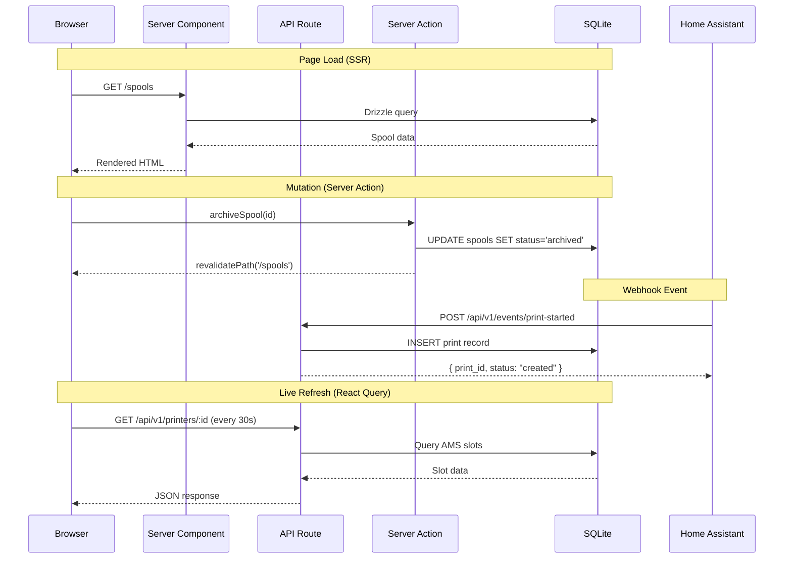
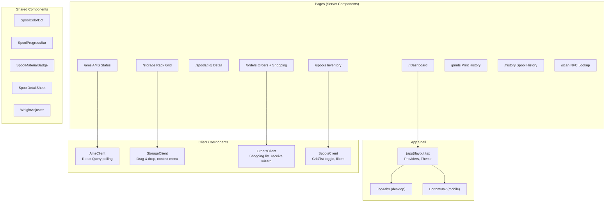
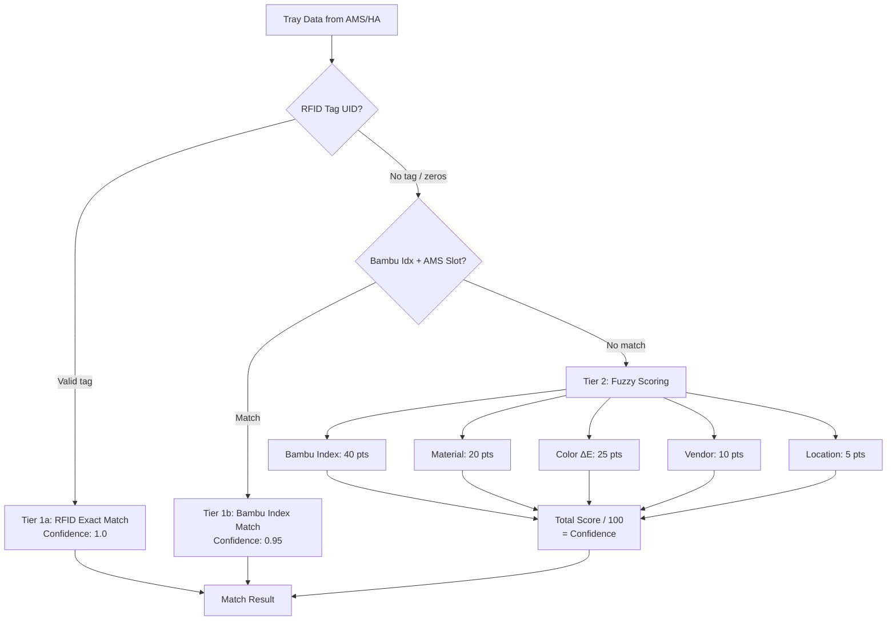

# Architecture Overview

## System Design

HASpoolManager is a Next.js 16 application using the App Router with Server Components for data-heavy pages and React Query for live-updating views.

### Request Flow

### Component Architecture

### Rendering Strategy

| Page | Rendering | Why |
|------|-----------|-----|
| Dashboard | Server Component | Aggregates from multiple tables, no interactivity needed for initial render |
| Spools | Server Component + Client wrapper | Server fetches + filters, client handles view toggle and URL state |
| Spool Detail | Server Component | Static data display, no live updates needed |
| AMS Status | Server Component + React Query | Initial SSR, then polls every 30s for live slot updates |
| Storage | Server Component + Client wrapper | Server fetches rack data, client handles drag & drop |
| Orders | Server Component + Client wrapper | Server fetches orders, client handles shopping list, dialogs |

### Data Mutation Pattern

All mutations use Next.js Server Actions (`"use server"`):
- `lib/actions.ts` — all mutation functions
- Each action updates the DB via Drizzle ORM
- Each action calls `revalidatePath()` to refresh affected pages
- Client components call actions directly (no API routes for mutations)

API Routes (`/api/v1/*`) are used for:
- Home Assistant webhook integration
- React Query polling (GET endpoints)
- AI order parsing
- Price crawling

### Security Layers

| Layer | Implementation |
|-------|---------------|
| HTTP Headers | X-Frame-Options, HSTS, nosniff, Referrer-Policy, Permissions-Policy |
| API Auth | Bearer token for HA webhooks (`requireAuth`) |
| Web UI Read | `optionalAuth` — no token needed for GET |
| Input Validation | Zod schemas on all POST routes |
| SQL Injection | Drizzle ORM parameterized queries |
| Error Monitoring | Sentry (when DSN configured) |

### Spool Matching Engine

Three-tier matching system for identifying spools:

