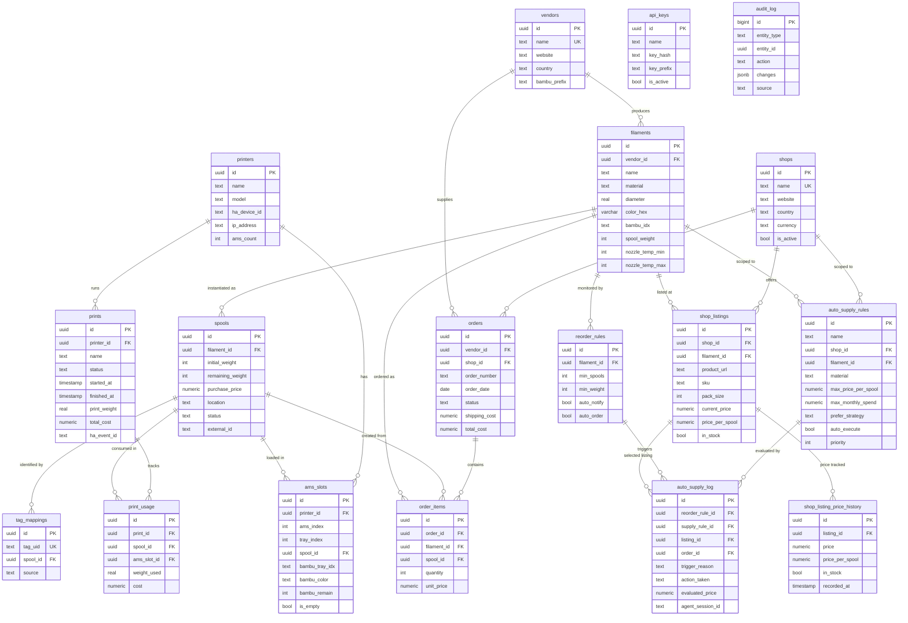

# HASpoolManager — Entity Relationship Diagram

```mermaid
erDiagram
    vendors ||--o{ filaments : "produces"
    vendors ||--o{ orders : "supplies"

    filaments ||--o{ spools : "instantiated as"
    filaments ||--o{ order_items : "ordered as"
    filaments ||--o{ reorder_rules : "monitored by"
    filaments ||--o{ shop_listings : "listed at"
    filaments ||--o{ auto_supply_rules : "scoped to"

    spools ||--o{ tag_mappings : "identified by"
    spools ||--o{ print_usage : "consumed in"
    spools ||--o{ ams_slots : "loaded in"
    spools ||--o{ order_items : "created from"

    printers ||--o{ ams_slots : "has"
    printers ||--o{ prints : "runs"

    prints ||--o{ print_usage : "tracks"

    orders ||--o{ order_items : "contains"

    shops ||--o{ shop_listings : "offers"
    shops ||--o{ orders : "purchased from"
    shops ||--o{ auto_supply_rules : "scoped to"

    shop_listings ||--o{ shop_listing_price_history : "price tracked"
    shop_listings ||--o{ auto_supply_log : "selected listing"

    reorder_rules ||--o{ auto_supply_log : "triggers"
    auto_supply_rules ||--o{ auto_supply_log : "evaluated by"

    vendors {
        uuid id PK
        text name UK
        text website
        text country
        text bambu_prefix
    }

    filaments {
        uuid id PK
        uuid vendor_id FK
        text name
        text material
        real diameter
        varchar color_hex
        text bambu_idx
        int spool_weight
        int nozzle_temp_min
        int nozzle_temp_max
    }

    spools {
        uuid id PK
        uuid filament_id FK
        int initial_weight
        int remaining_weight
        numeric purchase_price
        text location
        text status
        text external_id
    }

    tag_mappings {
        uuid id PK
        text tag_uid UK
        uuid spool_id FK
        text source
    }

    printers {
        uuid id PK
        text name
        text model
        text ha_device_id
        text ip_address
        int ams_count
    }

    ams_slots {
        uuid id PK
        uuid printer_id FK
        int ams_index
        int tray_index
        uuid spool_id FK
        text bambu_tray_idx
        text bambu_color
        int bambu_remain
        bool is_empty
    }

    prints {
        uuid id PK
        uuid printer_id FK
        text name
        text status
        timestamp started_at
        timestamp finished_at
        real print_weight
        numeric total_cost
        text ha_event_id
    }

    print_usage {
        uuid id PK
        uuid print_id FK
        uuid spool_id FK
        uuid ams_slot_id FK
        real weight_used
        numeric cost
    }

    orders {
        uuid id PK
        uuid vendor_id FK
        uuid shop_id FK
        text order_number
        date order_date
        text status
        numeric shipping_cost
        numeric total_cost
    }

    order_items {
        uuid id PK
        uuid order_id FK
        uuid filament_id FK
        uuid spool_id FK
        int quantity
        numeric unit_price
    }

    shops {
        uuid id PK
        text name UK
        text website
        text country
        text currency
        bool is_active
    }

    shop_listings {
        uuid id PK
        uuid shop_id FK
        uuid filament_id FK
        text product_url
        text sku
        int pack_size
        numeric current_price
        numeric price_per_spool
        bool in_stock
    }

    shop_listing_price_history {
        uuid id PK
        uuid listing_id FK
        numeric price
        numeric price_per_spool
        bool in_stock
        timestamp recorded_at
    }

    reorder_rules {
        uuid id PK
        uuid filament_id FK
        int min_spools
        int min_weight
        bool auto_notify
        bool auto_order
    }

    auto_supply_rules {
        uuid id PK
        text name
        uuid shop_id FK
        uuid filament_id FK
        text material
        numeric max_price_per_spool
        numeric max_monthly_spend
        text prefer_strategy
        bool auto_execute
        int priority
    }

    auto_supply_log {
        uuid id PK
        uuid reorder_rule_id FK
        uuid supply_rule_id FK
        uuid listing_id FK
        uuid order_id FK
        text trigger_reason
        text action_taken
        numeric evaluated_price
        text agent_session_id
    }

    api_keys {
        uuid id PK
        text name
        text key_hash
        text key_prefix
        bool is_active
    }

    audit_log {
        bigint id PK
        text entity_type
        uuid entity_id
        text action
        jsonb changes
        text source
    }
```
