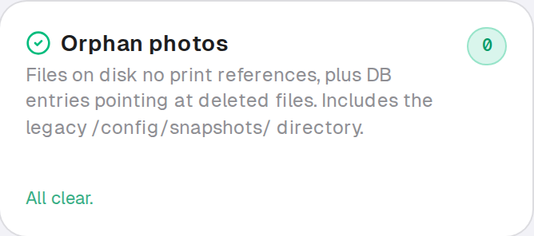
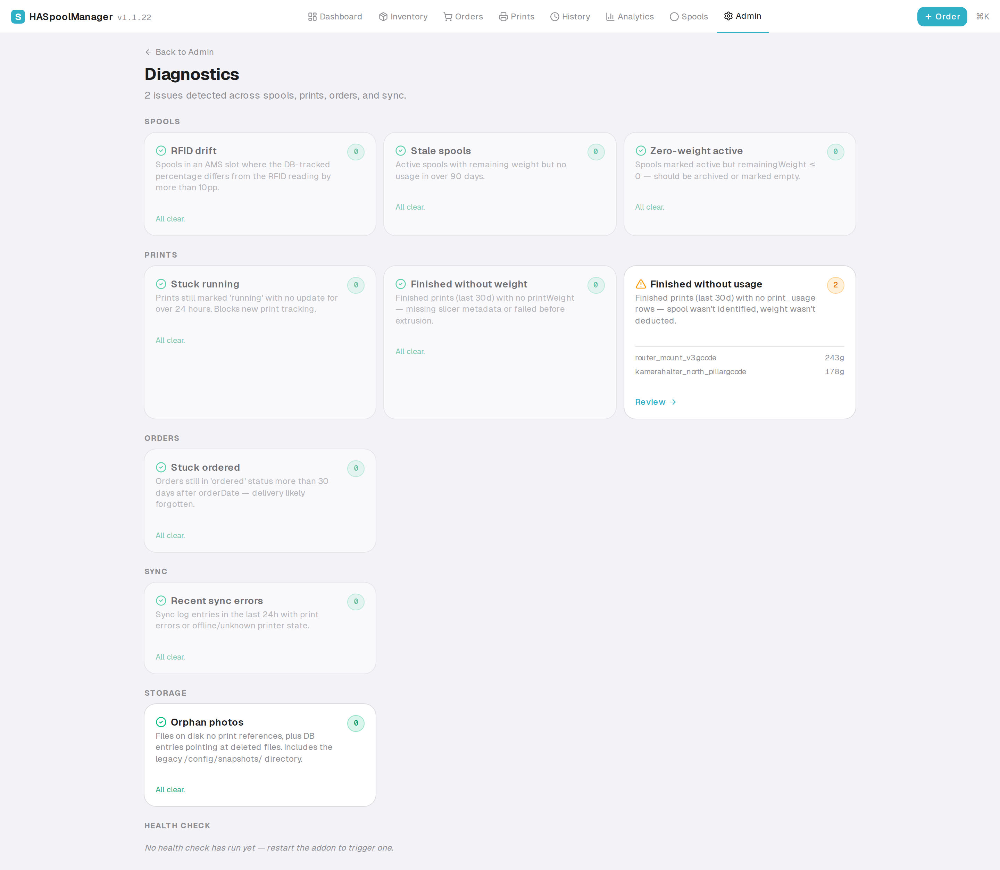

# Operations Runbook

Recipes for "my data looks weird" and "something broke" scenarios.
Ordered from most common to least common.

All SQL snippets assume you run them via `/api/v1/admin/sql/execute`
(write) or `/api/v1/admin/query` (read) — NOT via SMB-copy + local
sqlite3. See [`../development/getting-started.md`](../development/getting-started.md#8-querying-the-production-db) §8.

---

## 1. "A print is stuck at RUNNING"

**Symptom:** Prints page shows a job as `running` for hours after it
actually finished. AMS data may look stale.

**Auto-heal:** the sync route auto-closes prints that have been
`running` for >24h. Check `/admin/diagnostics` → "Stuck Prints" card.

**Manual fix:**

```sql
-- Identify the stuck print
SELECT id, name, status, started_at, updated_at, printer_id
FROM prints
WHERE status = 'running'
ORDER BY started_at DESC
LIMIT 5;

-- Mark it as failed so a new print can start
UPDATE prints
SET status = 'failed',
    finished_at = datetime('now'),
    notes = coalesce(notes, '') || ' [manually closed]'
WHERE id = 'paste-id-here';
```

Run the second query with `dryRun: true` first to verify the row.

---

## 2. "Spool weights don't match reality"

**Symptom:** Inventory shows 420 g but the AMS RFID reports 60%
remaining (600 g of 1000 g). Drift.

**Auto-heal:** during an active print, the sync engine reconciles
`remainingWeight` with AMS `remain%` on every state change (this is
the "weight sync" path — only runs for Bambu RFID-tagged spools).

**Manual sync from the UI:** Spool detail → "Sync from RFID" button.

**Manual SQL fix** (if UI won't work):

```sql
-- Show drift candidates
SELECT s.id, f.name, s.remaining_weight, s.initial_weight,
       asl.bambu_remain AS rfid_pct,
       round(s.initial_weight * asl.bambu_remain / 100.0) AS rfid_grams
FROM spools s
JOIN filaments f ON s.filament_id = f.id
JOIN ams_slots asl ON asl.spool_id = s.id
WHERE asl.bambu_remain BETWEEN 0 AND 100
  AND abs(s.remaining_weight - s.initial_weight * asl.bambu_remain / 100.0) > s.initial_weight * 0.1;

-- Fix one spool
UPDATE spools
SET remaining_weight = 600,  -- the RFID-derived value
    updated_at = datetime('now')
WHERE id = 'paste-id-here';
```

The diagnostics dashboard has a one-click link that takes you directly
to drift candidates: `/admin/diagnostics` → "Spool Drift" → each card
links to `/spools?issue=drift`.

---

## 3. "Rolling back a bad deploy"

Every deploy makes a backup. Rollback sequence:

```bash
# 1. List installed addon versions on HA
ssh root@homeassistant "ls -lh /addons/haspoolmanager-addon*.tar.gz 2>/dev/null"
# (there's usually just the most recent one. The old one is gone
#  unless you kept it.)

# 2. If you kept a local tar from a previous deploy:
scp ha-addon/dist/haspoolmanager-v1.1.2.tar.gz \
    root@homeassistant:/addons/haspoolmanager-addon.tar.gz
ssh root@homeassistant "rm -rf /addons/haspoolmanager && \
  tar -xzf /addons/haspoolmanager-addon.tar.gz -C /addons/ && \
  ha addons reload"
ssh root@homeassistant "ha addons restart local_haspoolmanager"
```

**If the rollback is because of a bad schema migration** (data loss or
corruption), restore the pre-deploy snapshot first:

```bash
# Stop addon FIRST (otherwise restore races WAL)
ssh root@homeassistant "ha addons stop local_haspoolmanager"

# Copy snapshot back (SMB mount)
cp testdata/db-snapshots/prod-YYYY-MM-DD-pre-X.db /Volumes/config/haspoolmanager.db
cp testdata/db-snapshots/prod-YYYY-MM-DD-pre-X.db-wal /Volumes/config/haspoolmanager.db-wal 2>/dev/null
cp testdata/db-snapshots/prod-YYYY-MM-DD-pre-X.db-shm /Volumes/config/haspoolmanager.db-shm 2>/dev/null

# Start addon with previous tar
ssh root@homeassistant "ha addons start local_haspoolmanager"
```

See also [`../development/release-process.md`](../development/release-process.md#rollback).

---

## 4. "Need to inspect sync-worker behavior"

### View recent logs

```bash
# Full log
ssh root@homeassistant "ha addons logs local_haspoolmanager 2>&1 | tail -200"

# Migration entries only
ssh root@homeassistant "ha addons logs local_haspoolmanager 2>&1 | grep '\[migrate\]'"

# Sync worker only
ssh root@homeassistant "ha addons logs local_haspoolmanager 2>&1 | grep '\[sync-worker\]'"

# Recent errors
ssh root@homeassistant "ha addons logs local_haspoolmanager 2>&1 | grep -i 'error\|fatal' | tail -20"
```

### Watch live

```bash
ssh root@homeassistant "ha addons logs local_haspoolmanager 2>&1 | tail -f"
```

### Recent sync calls

```sql
SELECT created_at, normalized_state, ha_event_type, source, printer_id
FROM sync_log
ORDER BY created_at DESC
LIMIT 20;
```

---

## 5. "A spool is stuck at location: storage"

`storage` is a transient sentinel. The Inventory page auto-moves
anything at `storage` to `workbench` on load.

If that isn't happening (shouldn't be possible but…):

```sql
-- How many are stuck?
SELECT count(*) FROM spools WHERE location = 'storage';

-- Move them manually
UPDATE spools
SET location = 'workbench', updated_at = datetime('now')
WHERE location = 'storage';
```

---

## 6. "Print had no `print_usage` row created"

**Symptom:** Print is `finished` but the Spool weight didn't update.
Diagnostics "No-Usage" card flags it.

Likely causes:
- `activeSpoolIds` was empty when the print finished (no spool matched)
- A crash between state transitions

**Manual fix:** Prints detail page → "Re-apply usage" (if the button
is present) — attempts to backfill based on stored `remain_snapshot`.

Or SQL (manual):

```sql
-- Find candidates
SELECT p.id, p.name, p.print_weight, p.active_spool_ids
FROM prints p
LEFT JOIN print_usage pu ON pu.print_id = p.id
WHERE p.status = 'finished'
  AND p.print_weight > 0
  AND pu.id IS NULL
LIMIT 10;

-- Insert the missing usage row (single-spool case)
INSERT INTO print_usage (id, print_id, spool_id, weight_used, cost, created_at)
SELECT
  lower(hex(randomblob(16))),
  p.id,
  json_extract(p.active_spool_ids, '$[0]'),
  p.print_weight,
  p.print_weight * (s.purchase_price / s.initial_weight),
  datetime('now')
FROM prints p
JOIN spools s ON s.id = json_extract(p.active_spool_ids, '$[0]')
WHERE p.id = 'paste-id-here';

-- And deduct from the spool
UPDATE spools
SET remaining_weight = remaining_weight - (
  SELECT print_weight FROM prints WHERE id = 'paste-id-here'
)
WHERE id = (
  SELECT json_extract(active_spool_ids, '$[0]') FROM prints WHERE id = 'paste-id-here'
);
```

---

## 7. "Supply alerts are wrong"

**Symptom:** Alerts for filaments you haven't used, or missing alerts
for ones you clearly need.

Check the consumption_stats:

```sql
SELECT f.name, cs.date, cs.weight_grams, cs.print_count
FROM consumption_stats cs
JOIN filaments f ON cs.filament_id = f.id
WHERE f.name LIKE '%PLA Basic Black%'
ORDER BY cs.date DESC
LIMIT 30;
```

Then force an analysis rerun:

```bash
curl -X POST http://homeassistant:3001/api/v1/supply/analyze \
  -H "Authorization: Bearer $API_KEY"
```

If a supply rule is configured wrong (e.g. points at a deleted
filament), `/admin/diagnostics` → Supply Rules card flags the orphan.

---

## 7b. "No cover image on Currently Printing card"

**Symptom:** A print is `running` but the Currently Printing card on
`/prints` and the dashboard `PrinterLiveCard` shows no preview image. DB
shows `photo_urls = NULL` for the running print.

**Cause:** Bambu's HA integration emits `event_print_started` BEFORE it has
uploaded the new model preview to its `image.<printer>_titelbild` entity.
HA's `image_proxy` returns 500 to anyone who tries to fetch the image during
that gap. The cover usually shows up 30s–15min after the event.

**Auto-recovery:** the sync-worker subscribes to `state_changed` for the
`cover_image` entity. As soon as Bambu pushes the cover, the worker fetches
and saves it automatically (see `lib/cover-capture.ts` +
`lib/sync-worker.ts`'s `tryCaptureCoverForPrinter`). Reload `/prints` after
a few minutes — the card should show the preview.

**Manual recovery (if auto failed):** click the camera icon in the photo
gallery on the running print's card. That triggers
`POST /api/v1/admin/capture-cover` which scans HA for any `image.*_titelbild`
or `image.*_cover_image` entity, fetches it, and saves as the cover. Logs
appear in the addon log under `[capture] cover (manual): ...`.

**Cleanup of leftover/duplicate cover files:** the manual capture replaces
the existing cover instead of stacking duplicates. Old photos from before
this change, or files left behind by manually-deleted prints, are caught
by the **Orphan photos** detector at `/admin/diagnostics` (Storage section).
Click "Cleanup now" to delete files no print references and strip dead
photo_urls entries.



**Diagnose the auto path** if manual works but auto doesn't:

```bash
ssh root@homeassistant "ha apps logs local_haspoolmanager --lines 1000 \
  | grep '\[capture\] cover'"
```

Expected log lines for a healthy capture:
```
[capture] cover (event_print_started): ... (race condition, expected)
[capture] cover (state_changed:cover_image): saved <printId>/cover-...jpg
```

If the second line never appears, the `cover_image` entity isn't mapped.
Check `/admin/printer-mappings` and confirm `cover_image` points at
`image.<printer>_titelbild` (or `_cover_image` on English HA).

---

## 7c. "Hundreds of duplicate ASA/PLA draft spools appeared"

**Symptom:** `/spools?status=draft` shows N identical "Unknown ASA"
(or other generic) drafts created within the last few hours, each at
1000g/1000g, mostly at `workbench` with one at the AMS slot.

**Cause:** A non-RFID spool sits in an AMS slot whose user-entered
filament colour (e.g. `FFFFFF` white) diverges from Bambu's
camera-reported colour (e.g. `C1C1C1` light grey). Each watchdog poll
(every 30 s during active prints) flip-flopped between binding the
active spool and detecting a "swap" — spawning a fresh draft each
cycle. Fixed in v1.1.20 with two guards:

- `autoCreateDraftSpool` dedups by `filament_id` + `status='draft'`
  before INSERT
- Swap-detection compares incoming `tray_color` to the slot's
  previously-observed `bambu_color` (not to the linked spool's
  `filament.color_hex`)

**Cleanup recipe** (assuming you've already updated to v1.1.20+):

```bash
# Dry-run: count and inspect the drafts
curl -s -X POST http://homeassistant.local:3001/api/v1/admin/sql/execute \
  -H "Authorization: Bearer $API_KEY" \
  -H "Content-Type: application/json" \
  -d '{
    "sql":"UPDATE spools SET status=?, location=?, updated_at=CURRENT_TIMESTAMP WHERE id IN (SELECT s.id FROM spools s JOIN filaments f ON s.filament_id=f.id JOIN vendors v ON f.vendor_id=v.id WHERE s.status=? AND f.material=? AND v.name=? AND f.color_hex=? AND s.initial_weight=1000 AND s.remaining_weight=1000)",
    "params":["archived","archive","draft","ASA","Unknown","C1C1C1"],
    "dryRun":true
  }'

# When dry-run reports the expected count, re-run with dryRun: false
```

Adjust the `material` and `color_hex` params for your case. After the
deploy of v1.1.20+, the oscillation cannot recur — the new test
`J6d: repeated syncs of an unmatchable non-RFID slot do NOT spawn
duplicate drafts` enforces this in CI.

**Prevent recurrence:** at the printer, set the AMS-HT slot's colour
in Bambu Studio to match what the user-entered `filament.color_hex`
says. Or update the filament colour in the app to match what Bambu's
camera reports.

---

## 8. "DB is corrupted / won't open"

**Symptom:** addon won't start, logs show `SQLite: database is malformed`
or `disk image is corrupted`.

1. Stop addon: `ssh root@homeassistant "ha addons stop local_haspoolmanager"`
2. Copy the DB file off HA for offline inspection:
   ```bash
   cp /Volumes/config/haspoolmanager.db* testdata/db-snapshots/corrupted-$(date +%Y-%m-%d).db*
   ```
3. Try `sqlite3 corrupted.db ".recover" | sqlite3 recovered.db` — dumps
   what's readable into a fresh file
4. If recovery succeeds, copy `recovered.db` back to `/Volumes/config/`
5. If not, restore your latest good snapshot

Prevention: every schema-changing deploy should take a snapshot. See
[`../development/release-process.md`](../development/release-process.md).

---

## 9. "Data quality looks bad overall"

Start at `/admin/diagnostics` — nine live detectors plus an orphan-photos
cleanup card surface every kind of data drift:



Each card deep-links to the affected records with `?issue=<id>` and a
banner explaining the rule. Use that as the entry point before running
scripts.

Run the cleanup scripts in preview mode (dry run):

```bash
npx tsx scripts/run-all-cleanups.ts            # preview everything
npx tsx scripts/run-all-cleanups.ts --apply    # commit fixes
```

Individual scripts:
- `scripts/cleanup-shops.ts` — dedupe shops
- `scripts/preview-color-corrections.ts` — fix filament colors from SpoolmanDB
- `scripts/backfill-energy-estimates.ts` — estimate historical energy for pre-energy-tracking prints
- `scripts/link-unlinked-order-items.ts` — attach received spools to order rows

`scripts/health-check.js` runs nightly and logs to the `data_quality_log`
table; surface via `/admin/diagnostics` → Health Check section.

---

## 10. Snapshot policy

- Before every schema-changing deploy → full snapshot into
  `testdata/db-snapshots/prod-YYYY-MM-DD-pre-X.db*` (all three files: .db, .db-wal, .db-shm)
- After major DB migrations run successfully → also snapshot the
  post-state if you want to roll forward
- Before running any `--apply` cleanup script → snapshot

Snapshot files are gitignored; kept locally. Keep them around for at
least 30 days after a feature ships.

---

## 11. Automated backups

A scheduled backup runs **daily at 03:00 Europe/Berlin** inside the
sync-worker process. Backups are gzipped SQLite dumps (WAL-safe via
`better-sqlite3`'s `.backup()` API) stored at
`/config/haspoolmanager/backups/haspoolmanager-YYYY-MM-DDTHH-MM-SS.db.gz`.

Default retention: **14 days**. Older backups are deleted automatically
after each successful run.

### Trigger a backup manually

- **UI:** `/admin` → "Automated Backups" card → "Backup now" button.
- **API:** `POST /api/v1/admin/backup` (Bearer required); see
  [`../reference/api.md`](../reference/api.md).
- **On startup:** if the backup dir is empty, a smoke-test backup runs
  60 s after sync-worker start to catch config issues early.

### Restore from a backup

```bash
# Stop addon (so WAL writes don't race)
ssh root@homeassistant "ha addons stop local_haspoolmanager"

# Unpack the chosen backup
ssh root@homeassistant "cd /config/haspoolmanager/backups && \
  gzip -dc haspoolmanager-YYYY-MM-DDTHH-MM-SS.db.gz > /config/haspoolmanager.db && \
  rm -f /config/haspoolmanager.db-wal /config/haspoolmanager.db-shm"

# Start addon
ssh root@homeassistant "ha addons start local_haspoolmanager"
```

Verify with `curl http://homeassistant:3001/api/v1/health` that the
addon came back up, then open the UI and sanity-check recent prints
and spool weights.

### Relationship to manual snapshots

Automated backups do **not** replace the manual pre-deploy snapshot
policy (§10). They're an extra safety net for day-to-day data
corruption; snapshots are for intentional risky operations where you
want a named restore point under your direct control.

---

## 11. Where to file feedback when a recipe is missing

Open an issue — include:
- What you were trying to do
- What happened
- Log excerpt from `ha addons logs local_haspoolmanager`
- Relevant queries from `/admin/diagnostics`
