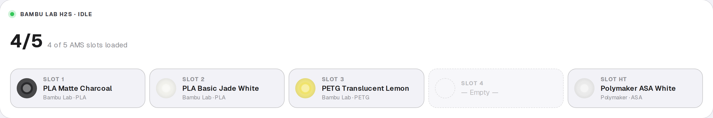
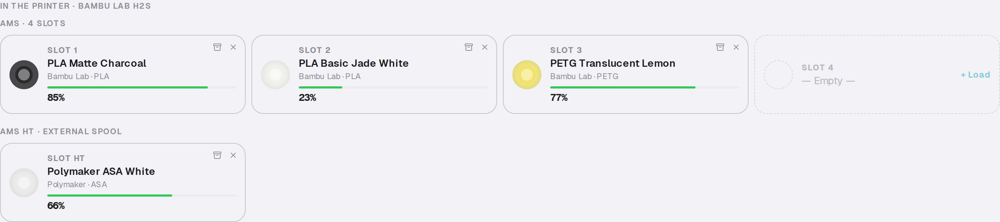
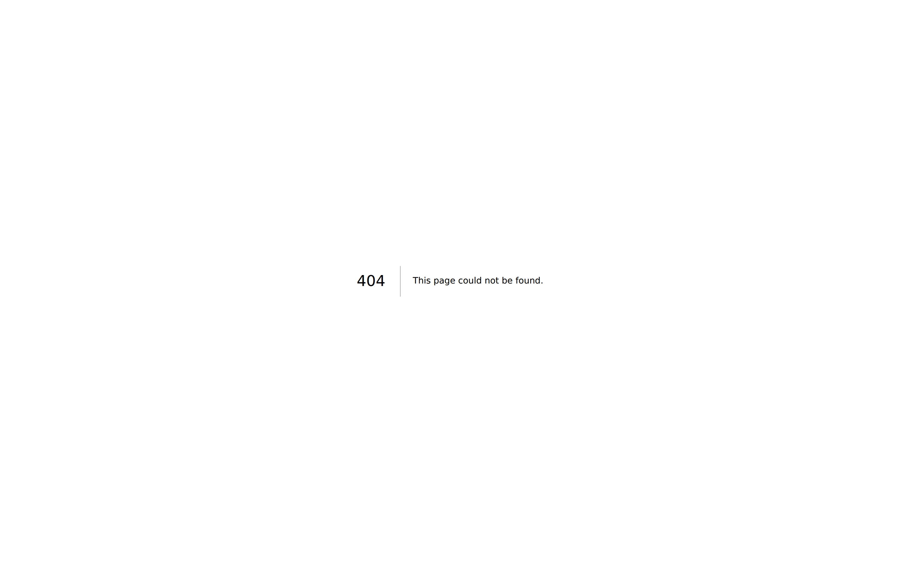
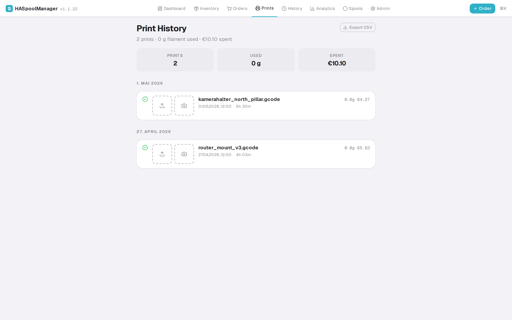
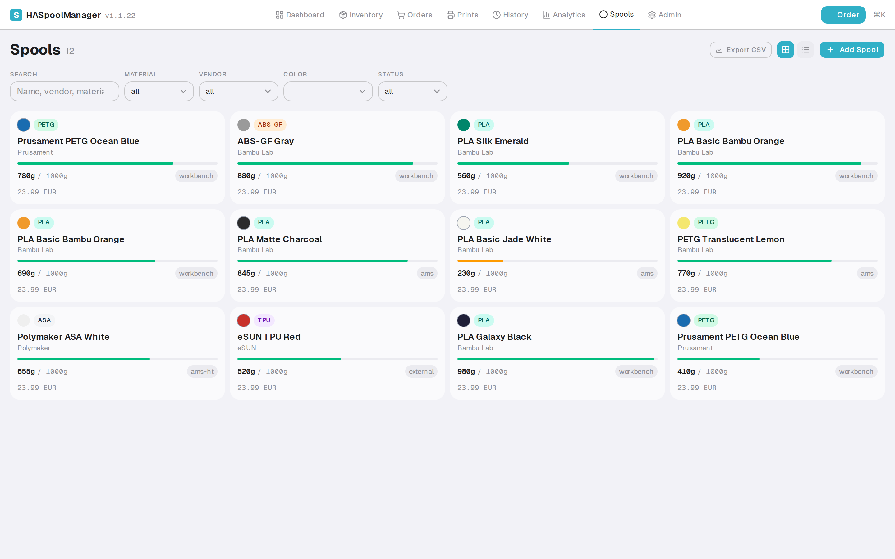

# User Guide

Day-to-day workflows with HASpoolManager. If you've just installed the
addon, start with [`installation.md`](installation.md); if you want to
understand how things work under the hood, jump to
[`../architecture/overview.md`](../architecture/overview.md).

The **Dashboard** is the daily landing page — printer status, monthly
spend, prints, low-stock alerts, recent prints, and analytics charts
all on one screen:


The printer hero (top of the dashboard) shows live AMS slot state at
a glance — material per slot, remaining %, idle vs. printing badge:



---

## 1. The location system

Every spool is in exactly one place. The locations form a lifecycle:

```
Purchased → Rack → AMS → Workbench → Rack → … → Empty → Archive
                ↓↑
            Surplus (overflow when rack is full)
```

| Location | Meaning |
|---|---|
| `ordered` | Purchased, not yet received |
| `rack:<id>:R-C` | Slotted into a physical rack position (row R, column C of rack `<id>`) |
| `ams` | Loaded in the main AMS unit |
| `ams-ht` | Loaded in the AMS HT |
| `external` | On the external spool holder |
| `surplus` | Overflow storage (when the rack is full) |
| `workbench` | Temporarily out of rack — actively in use or being prepped |
| `storage` | Sentinel for "needs a home" (auto-moves to workbench on next page load) |
| `archive` | Empty / returned / permanently retired |

The **Inventory** page is the cockpit: AMS section on top, rack grid(s)
below, then Workbench + Surplus as flat lists.


The AMS section close-up — Bambu H2S with its 4-slot AMS plus the AMS HT
external spool, each tile showing material, vendor, and remaining %:



---

## 2. Buying filament → receiving an order

### A. Place the order

Three paths in the app:

1. **`/orders` → "+ New Order"** — pick shop, add line-items (filament
   + quantity), save. Status starts at `ordered`.
2. **Paste email** — `/orders` → "Paste Email" bubble. Drop a plaintext
   or HTML order confirmation, Claude parses vendor + items + prices if
   `ANTHROPIC_API_KEY` is configured.
3. **CSV import** — `/admin` → "Import Orders" card. Batch import from
   a CSV matching the template.

A placeholder `spool` row gets created for every item, `location: "ordered"`.



### B. Receive the order

When the package arrives, `/orders` → the order → **Receive** button
opens the Receive Wizard:

1. One spool at a time
2. Pick a rack slot (or multiple racks if you have more than one
   configured) — or click **Store in Surplus**
3. Repeat until every spool has a home

Under the hood: each placement sets `spools.location` to the chosen
value and bumps the printer's cost ledger.

### C. Edge cases

- **Rack full?** → Surplus fits unlimited spools
- **Wrong vendor/name?** → Edit the spool after receiving (Inventory →
  click spool → edit)
- **Missing items?** → Still mark received; the missing spool rows stay
  at `ordered` and show as "awaiting"

---

## 3. Printing — what happens automatically

When the printer starts a job, the sync worker writes to DB **without
any manual action from you**:

1. **Print starts** — `prints` row created with `status = "running"`,
   the current AMS slot contents captured as `remain_snapshot`. Energy
   meter (kWh) is read for later cost computation.
2. **Cover image captured** — Bambu's slicer preview lands on the
   `cover_image` HA entity 30 s–15 min after the start event; the sync
   worker watches for that `state_changed` and saves it to
   `/config/haspoolmanager/photos/<printId>/cover.jpg`. Race-resistant
   and idempotent (re-firing the manual capture replaces, the auto
   path is append-skip).
3. **Active spool identified** — via RFID tag on the AMS tray, or
   Bambu filament-idx + slot memory, or color/material fuzzy match.
   Every spool seen during the print accumulates in `activeSpoolIds`.
4. **Watchdog poll** — every 30 s the worker pulls fresh
   `print_progress` and `print_remaining_time` from HA so the dashboard
   never goes stale (Bambu's HA integration reports remaining time in
   hours with minute-precision; we convert at the UI boundary).
5. **Mid-print swap detected** — if the AMS slot's last-observed
   bambu-color changes by more than the ΔE threshold OR an RFID-runout
   event fires, the swap is recorded and the old spool moves to
   workbench. Non-RFID color drift (where the user-entered filament
   colour diverges from Bambu's camera reading) no longer spawns
   duplicate drafts thanks to the identity-dedup guard in
   `autoCreateDraftSpool`.
6. **Print finishes** — final weight deducted from the spool's
   `remainingWeight`. Multi-spool prints distribute weight by AMS
   remain-delta or 3MF per-tray weights when available. A camera
   snapshot is saved alongside the cover image.
7. **Cost computed** — filament cost (price-per-spool × grams used) +
   energy cost (kWh × price) → `prints.totalCost`.
8. **Sync log entry** — `sync_log` table records the event for the
   `/admin/diagnostics` dashboard.

**You do nothing.** The Inventory page auto-refreshes, the Prints page
shows the new record, the Dashboard widgets update.



### When things go wrong

- **Print shows "running" for too long** → `/admin/diagnostics` flags it
  as stuck after 24h; auto-closed on the next sync
- **Wrong spool attributed** → Prints detail → edit the active spool
  list
- **Weight doesn't match reality** → Spool detail → "Sync from RFID"
  (pulls AMS remain%) or manual override

---

## 4. Reorder alerts

The Supply Engine watches consumption and warns before you run out:

1. **Set rules** on `/orders` → Supply Rules card: "keep at least 2
   spools of PETG Bambu Black"
2. **Alerts appear** when a rule would be violated by projected
   consumption (EMA × days-until-empty + trend)
3. **Optimized Cart** groups suggested purchases by shop, respecting
   free-shipping thresholds and bulk discounts
4. **You confirm** — one click adds the suggested order to the
   shopping list, or jumps straight to the "+ New Order" dialog
   pre-populated

The engine **never places an order automatically**. You're always in
the loop.

---

## 5. Everyday management

### Browsing all spools

`/spools` shows the flat catalogue with material, vendor, color, and
status filters. The grid view is best for at-a-glance browsing; the
list view (toggle top-right) makes bulk-edit work easier.



### Adding a spool manually

Inventory → "+ Add Spool" → pick filament from dropdown (or create new
filament + vendor on the fly) → enter initial weight + optional lot
number + position.

### Adding many spools at once

Same dialog, Library tab — two extra fields:

- **Anzahl** (1–100): how many identical spools to create in one go
- **Lot-Nummer** (optional): a base string like `B2026Q2`

When count > 1, the lot-number gets a zero-padded sequence suffix:
`B2026Q2-001`, `B2026Q2-002`, … `B2026Q2-100`. When count = 1, the
lot-number is used as-is. Values are clamped: below 1 → 1, above 100
→ 100. All spools land in `location = workbench` with the chosen
initial weight; position them afterwards by drag-drop.

### Identifying a spool physically

Inventory → click any spool → opens the Spool Inspector with weight,
location, cost-per-gram, identification table, and print history.


### Moving spools

Drag-and-drop on the rack grid. Cross-rack drag works (if you have
multiple racks). Swap: drop on an occupied cell → the two spools
exchange positions.

### Archiving

Use up a spool → `remainingWeight = 0` → it auto-moves to Archive on
next sync. You can also manually archive a spool from its detail view.

### AMS rename + disable

`/admin` → AMS Units card. Rename an AMS unit (e.g. "AMS 1" → "AMS
Werkstatt"). Disable an unused AMS — its loaded spools move to storage
and stop syncing.

---

## 6. Diagnostics

`/admin/diagnostics` surfaces nine live health checks plus storage cleanup:

| Detector | Trigger |
|---|---|
| Spool drift | DB vs RFID remain differ by >10pp |
| Stale spools | Not used in 90+ days |
| Zero-active | Spool shows "active" but 0 g remaining |
| Stuck prints | `running` for >24h |
| No-weight | Finished print with 0 g recorded |
| No-usage | Finished print without a `print_usage` row |
| Stuck orders | `ordered` status for >30 days |
| Recent sync errors | Last N entries from `sync_log` with level `error` |
| Orphan photos | Files no print references, dead `photo_urls` entries, legacy `/config/snapshots/` dump — single "Cleanup now" button |


Each card deep-links to the affected records with an `?issue=<id>`
query param and banner. Below that, the Health-Check section shows
per-rule results from the overnight `health-check.js` run.

For the gory details see
[`operations-runbook.md`](operations-runbook.md).

---

## 7. iOS home-screen PWA

Port 3001 has no HA-auth hop, so the PWA loads fast and works offline
for view-only actions. Add to home screen via Safari — see
[`ios-pwa-setup.md`](ios-pwa-setup.md).

An optional iOS Shortcut pre-fills NFC tag IDs into the `/scan` page so
you can tap a spool sticker and jump straight to its detail view.

---

## 8. Where to find everything in the UI

| I want to… | Go to |
|---|---|
| See what's in my printer right now | Inventory → AMS section |
| See what's on the rack | Inventory → rack grid(s) |
| Look up a specific spool | Spools → filter/search |
| See recent prints | Prints (or Dashboard "Recent Prints") |
| Track costs | Dashboard, or Prints (each row) |
| Manage orders | Orders |
| Check reorder alerts | Orders → Supply Alerts card, or Dashboard widget |
| Investigate data weirdness | Admin → Diagnostics |
| Change AMS unit names | Admin → AMS Units card |
| Add / rename / archive a rack | Admin → Racks card |
| Configure energy tracking | Admin → Energy Tracking card |
| Manage shops + price lookup | Orders → Shop Configuration |
| Tweak supply rules | Orders → Supply Rules card |
| Set monthly budget | Orders → Monthly Budget card |
| Import orders from CSV/email | Admin → Import Orders, or Orders → Paste Email |
| Scan an NFC/RFID tag manually | Scan |

---

## 9. When something is wrong

- **Data looks weird?** → Diagnostics first, then
  [`operations-runbook.md`](operations-runbook.md)
- **Addon won't start / sync worker offline?** →
  [`troubleshooting.md`](troubleshooting.md)
- **Need to roll back a deploy?** →
  [`../development/release-process.md`](../development/release-process.md)
