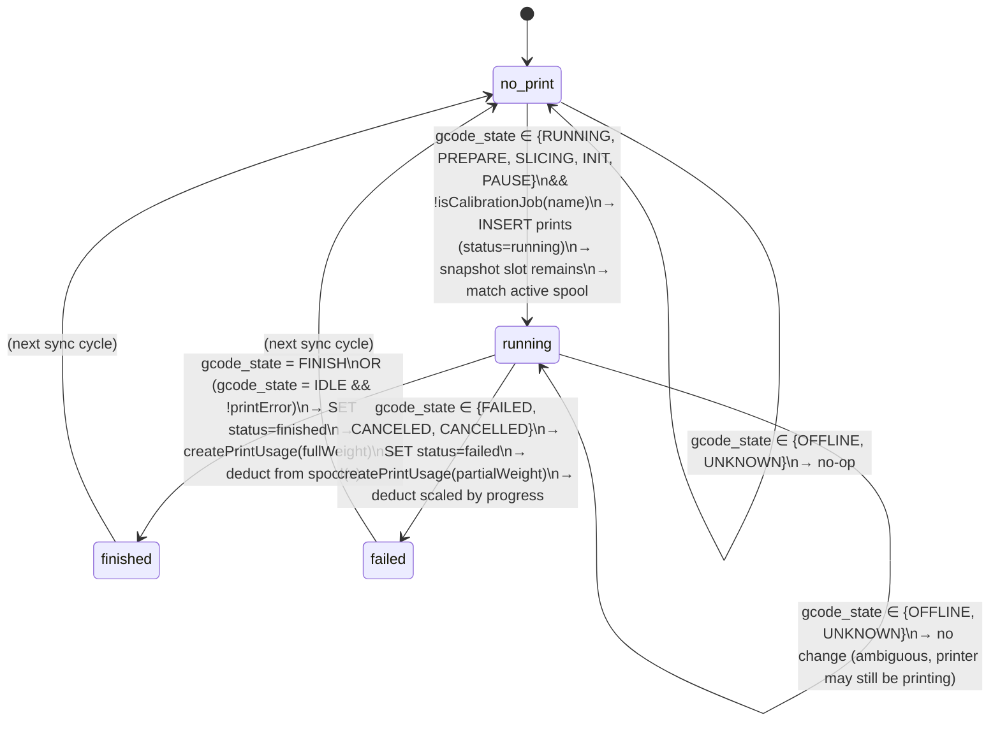
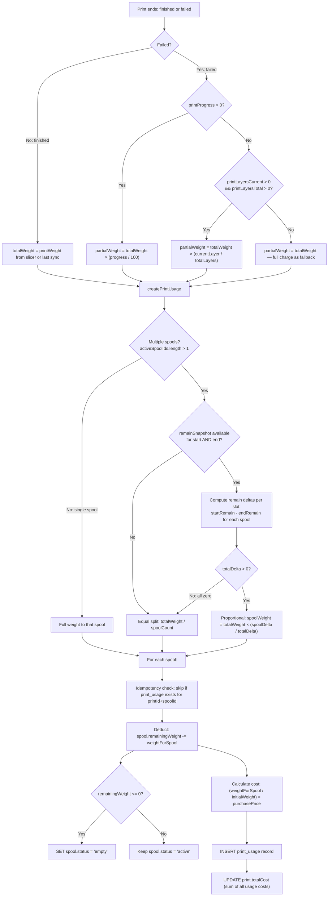
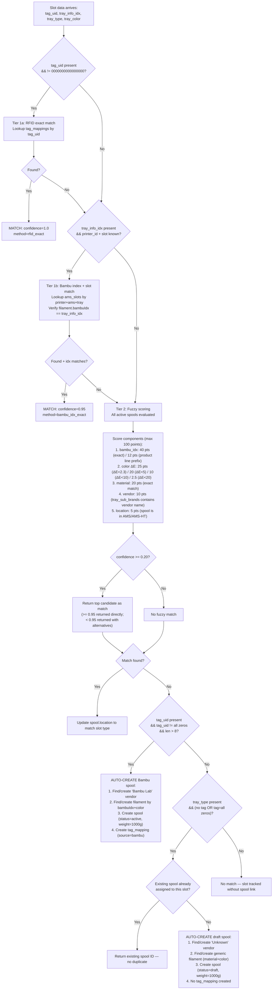
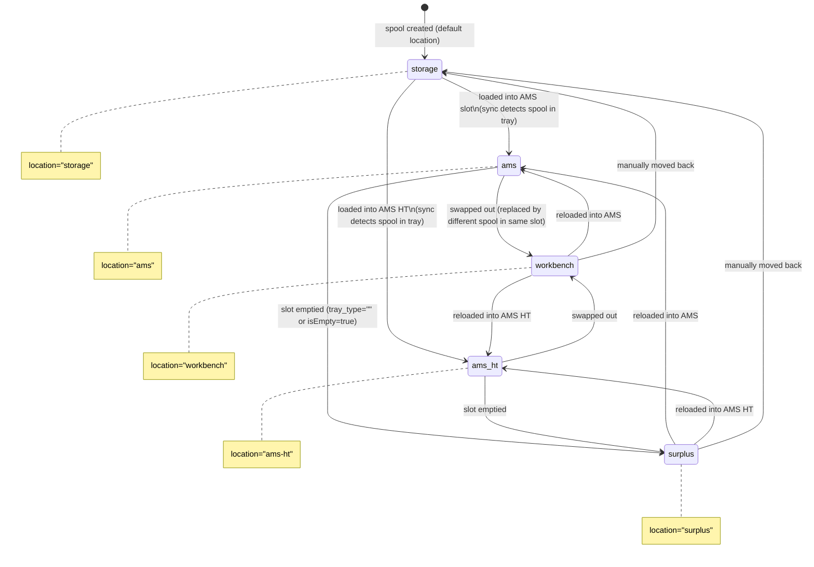
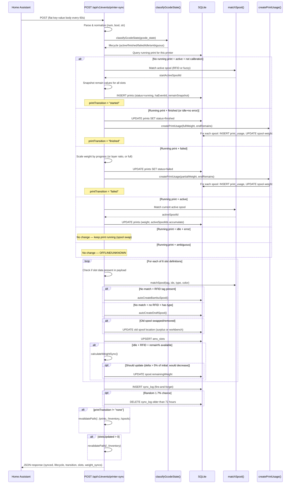
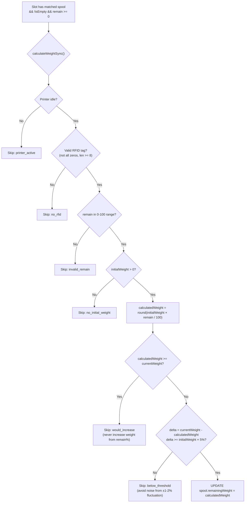

# HASpoolManager — Print Tracking State Machine

> Generated from the actual implementation in `app/api/v1/events/printer-sync/route.ts`,
> `lib/printer-sync-helpers.ts`, and `lib/matching.ts`. Documents what the code does,
> not aspirational behavior.

---

## 1. Printer State Classification

The sync endpoint receives `gcode_state` (coarse, 10 values) and `print_state` / `stg_cur`
(fine-grained, 68+ values). Lifecycle decisions use `gcode_state` exclusively via
`classifyGcodeState()`. The `stg_cur` value is stored for display only.

### `classifyGcodeState()` mapping

| `gcode_state` | Lifecycle | Description |
|---|---|---|
| `RUNNING` | **active** | Actively printing (all sub-stages: homing, heating, extruding) |
| `PREPARE` | **active** | Job accepted, printer preparing (downloading, parsing) |
| `SLICING` | **active** | Cloud slicing in progress |
| `INIT` | **active** | Initializing print sequence (brief transitional state) |
| `PAUSE` | **active** | Print paused (user, M400, filament runout, error) — recoverable |
| `FINISH` | **finished** | Print completed successfully |
| `FAILED` | **failed** | Print failed due to error |
| `CANCELED` / `CANCELLED` | **failed** | User cancelled — treated identically to failed |
| `IDLE` | **idle** | No job active |
| `OFFLINE` | **ambiguous** | Printer unreachable — do not change running state |
| `UNKNOWN` / empty | **ambiguous** | State unknown — do not change running state |

**Implementation** (`lib/printer-sync-helpers.ts`):

```typescript
const GCODE_ACTIVE = new Set(["RUNNING", "PREPARE", "SLICING", "INIT", "PAUSE"]);
const GCODE_FINISH = new Set(["FINISH"]);
const GCODE_FAILED = new Set(["FAILED", "CANCELED", "CANCELLED"]);
const GCODE_IDLE   = new Set(["IDLE"]);
// Everything else → "ambiguous"
```

### Calibration filter

Before creating a print record, the sync endpoint checks `isCalibrationJob(printName)`.
Calibration routines cycle through `IDLE -> RUNNING -> FINISH -> IDLE` like real prints
but are filtered out by name matching:

| Calibration name pattern | Example |
|---|---|
| `auto_cali` | Auto-calibration routine |
| `auto_calibration` | Auto-calibration (alternate) |
| `user_param` | User parameter calibration |
| `default_param` | Default parameter calibration |

---

## 2. Print Lifecycle State Machine

### Mermaid statechart



### Transition detail

| From | To | Condition | DB Actions |
|---|---|---|---|
| `no_print` | `running` | `!runningPrint && isActive && !isCalibrationJob` | `INSERT prints` with haEventId, remainSnapshot, activeSpoolId(s) |
| `running` | `finished` | `runningPrint && (isFinished \|\| (isIdle && !printError))` | `UPDATE prints SET status=finished`, `createPrintUsage(fullWeight)` |
| `running` | `failed` | `runningPrint && isFailed` | `UPDATE prints SET status=failed`, `createPrintUsage(partialWeight)` |
| `running` | `running` | `runningPrint && isActive` | `UPDATE prints SET printWeight`, accumulate `activeSpoolIds` |
| `running` | `running` | `runningPrint && isIdle && printError` | No change — waiting for spool swap or user action |
| `running` | `running` | `runningPrint && lifecycle=ambiguous` | No change — OFFLINE/UNKNOWN do not alter state |
| `no_print` | `no_print` | `!runningPrint && !isActive` | No-op |

### Flow: Normal print

```
IDLE → PREPARE → RUNNING → FINISH → IDLE
  │                                    │
  └── sync: started ──────────────── sync: finished
```

### Flow: Failed / cancelled print

```
IDLE → PREPARE → RUNNING → FAILED → IDLE
  │                          │
  └── sync: started ──── sync: failed (partial weight × progress%)
```

### Flow: Pause and resume

```
RUNNING → PAUSE → RUNNING → FINISH
   │         │        │
   │         │        └── still "active" lifecycle, no transition
   │         └── "active" lifecycle, print stays running
   └── print remains running throughout
```

### Flow: Filament runout (spool swap)

```
RUNNING → PAUSE(stg_cur=6) → IDLE+error → ... → IDLE-error → RUNNING → FINISH
   │           │                   │                              │
   │           │                   └── runningPrint kept alive     │
   │           └── "active" lifecycle                              │
   └── activeSpoolIds accumulates new spool on resume
```

The key mechanism: when `gcode_state=IDLE` but `printError=true`, the print stays
in `running` status. When the error clears (`IDLE + !printError`), it transitions
to `finished` (not started as a new print).

### Flow: Calibration skip

```
IDLE → RUNNING(name="auto_cali") → FINISH → IDLE
                    │
                    └── isCalibrationJob=true → no print record created
```

---

## 3. Weight Deduction Logic



### Weight source priority

1. **Finished print**: `printWeight` from the current sync payload, falling back to
   `runningPrint.printWeight` (stored during the print).
2. **Failed print**: Same source, then scaled by `progress / 100`.

### Multi-spool proportional distribution

When a print uses multiple spools (tracked via `activeSpoolIds`), the system uses
AMS `remain` percentage deltas to distribute weight proportionally:

1. At print **start**: snapshot `remain` values for all slots → stored in `prints.remainSnapshot`
2. At print **end**: read current `remain` values from the sync payload
3. For each spool: `delta = startRemain[slot] - endRemain[slot]`
4. Proportional weight: `spoolWeight = totalWeight * (spoolDelta / sumOfAllDeltas)`
5. **Fallback**: if all deltas are zero or remain data is missing → equal split

### Single spool

When only one spool was used (or for backward compatibility with `activeSpoolId`),
the full weight goes to that spool. No proportional calculation needed.

### Spool swap mid-print

The current implementation handles spool swaps by accumulating `activeSpoolIds` during
the print. Each time the active spool changes (detected via RFID or fuzzy matching
on each sync), the new spool ID is appended to the array. At print end, proportional
weight distribution uses remain deltas to split weight between all spools used.

**Note**: The planned `print_error` code parsing for exact runout slot identification
(documented in `docs/plan-ha-native-sync.md`) is not yet implemented. The current
`printError` field is a boolean, not the raw integer error code.

---

## 4. Spool Matching Decision Tree



### Fuzzy scoring weights

| Factor | Points | Condition |
|---|---|---|
| `bambu_idx` exact | 40 | `filament.bambuIdx === tray_info_idx` |
| `bambu_idx` prefix | 12 | First 3 chars match (same product line) |
| Material | 20 | Case-insensitive exact match |
| Color (ΔE < 2.3) | 25 | Imperceptible difference |
| Color (ΔE < 5) | 20 | Close match |
| Color (ΔE < 10) | 10 | Perceptible but similar |
| Color (ΔE < 20) | 2.5 | Different but same family |
| Vendor | 10 | `tray_sub_brands` contains vendor name |
| Location | 5 | Spool is currently in AMS or AMS-HT |

Minimum confidence threshold: **0.20** (20 out of 100 points).
High confidence threshold: **0.95** (returned without alternatives).

---

## 5. AMS Slot Lifecycle



### Slot definitions (hardcoded)

| Key | Slot Type | AMS Index | Tray Index | Physical Position |
|---|---|---|---|---|
| `slot_1` | `ams` | 0 | 0 | AMS slot 1 |
| `slot_2` | `ams` | 0 | 1 | AMS slot 2 |
| `slot_3` | `ams` | 0 | 2 | AMS slot 3 |
| `slot_4` | `ams` | 0 | 3 | AMS slot 4 |
| `slot_ht` | `ams_ht` | 1 | 0 | AMS HT slot |
| `slot_ext` | `external` | -1 | 0 | External spool holder |

### Location transitions triggered by sync

| Scenario | Old spool location set to | New spool location set to |
|---|---|---|
| Slot was occupied, now empty | `surplus` | (no new spool) |
| Slot was occupied, now different spool | `workbench` | `ams` / `ams-ht` / `external` |
| Slot was empty, now occupied | (no old spool) | `ams` / `ams-ht` / `external` |

### Spool status values (application-level, not sync-driven)

| Status | Meaning |
|---|---|
| `active` | In use, has remaining filament |
| `draft` | Auto-created, needs user review |
| `empty` | Remaining weight reached 0 after print |
| `archived` | User manually archived |
| `returned` | Returned to vendor |

---

## 6. Sync Event Processing



---

## 7. Idempotency Guards

| Mechanism | Location | Purpose |
|---|---|---|
| **`ha_event_id` uniqueness** | `prints` table | Prevents duplicate print records for the same job. Built from `sync_{printerId}_{date}_{name}`. If a record with the same prefix exists, a counter suffix `_2`, `_3` etc. is appended. |
| **`print_usage` composite check** | `createPrintUsage()` | Before inserting a usage record, queries for existing `(printId, spoolId)` pair. Skips if already exists. |
| **Draft spool duplicate prevention** | `autoCreateDraftSpool()` | Before creating a draft spool, checks if the target AMS slot already has a spool assigned. Returns existing `spoolId` if so. Prevents creating 100+ drafts on every 60s sync cycle. |
| **Tag mapping race guard** | `autoCreateBambuSpool()` | Before creating a new Bambu spool, checks if a `tag_mappings` record already exists for that `tagUid`. Returns existing `spoolId` if found. |
| **Ambiguous state no-op** | Lifecycle classification | `OFFLINE` and `UNKNOWN` states return `"ambiguous"`, which triggers no state transitions. Prevents closing prints during connectivity drops. |
| **Calibration filter** | Print creation guard | `isCalibrationJob()` prevents auto-calibration routines from creating spurious print records, even though they cycle through the same `RUNNING -> FINISH` states. |
| **Weight sync guards** | `calculateWeightSync()` | Multiple guards prevent spurious weight updates: only when idle, only with valid RFID, only when weight would decrease, only when delta exceeds 5% of initial weight. |
| **Running print singleton** | Print start guard | A new print is only created when `!runningPrint && isActive`. While a print is running, no second print record can be created for the same printer. |

---

## 8. Error Code Reference

### Current implementation

The sync endpoint receives `print_error` as a **boolean** (via the `bool()` parser from
HA's `binary_sensor.PRINTER_print_error`). It does NOT currently parse the raw integer
error code. The boolean is used solely to distinguish between:

| `gcode_state` | `printError` | Behavior |
|---|---|---|
| `IDLE` | `false` | Running print → `finished` (missed FINISH event) |
| `IDLE` | `true` | Running print → stays `running` (filament runout / spool swap in progress) |
| `FAILED` | (any) | Running print → `failed` |
| `FINISHED` | (any) | Running print → `finished` |

### Bambu Lab error codes (from MQTT `print_error` integer field)

These are documented in `docs/07-bambulab-printer-states.md` and `docs/plan-ha-native-sync.md`
but are **not yet parsed** by the current implementation:

| Error Code | Hex | Meaning | Current Handling |
|---|---|---|---|
| `0` | `0x00000000` | No error | `printError=false` |
| `50348044` | `0x0300800C` | User cancel | Mapped to `gcode_state=FAILED` → status `"failed"` |
| `0x07008011` | AMS tray 0 | AMS filament runout (slot 1) | `printError=true` → keep running |
| `0x07018011` | AMS tray 1 | AMS filament runout (slot 2) | `printError=true` → keep running |
| `0x07028011` | AMS tray 2 | AMS filament runout (slot 3) | `printError=true` → keep running |
| `0x07038011` | AMS tray 3 | AMS filament runout (slot 4) | `printError=true` → keep running |
| `0x18008011` | AMS HT tray 0 | AMS HT filament runout | `printError=true` → keep running |
| `0x07FF8011` | External | External spool runout | `printError=true` → keep running |

### Error code structure (planned, not implemented)

```
0xMMSS8011
  MM = module:  0x07 = AMS,  0x18 = AMS HT
  SS = slot:    0x00-0x03 (AMS),  0x00 (AMS HT),  0xFF (external)
  8011 = runout error suffix (constant)
```

### Planned improvement

The `docs/plan-ha-native-sync.md` describes parsing the raw integer error code to identify
the exact slot that ran out, enabling precise weight split at the runout point. This would
require receiving `print_error` as an integer rather than a boolean from HA.

---

## 9. Weight Sync from AMS Remain

Separate from print-based weight deduction, the sync endpoint also updates spool weights
from the AMS `remain` percentage (RFID-based estimate from the Bambu printer).



### Guards summary

1. Only when printer is **idle** (not during active printing)
2. Only for spools with valid **RFID tags** (Bambu spools)
3. Never **increases** weight (remain% can fluctuate upward due to estimation)
4. Minimum **5% delta** threshold to avoid noisy small updates
5. `remain` must be in valid 0-100 range
