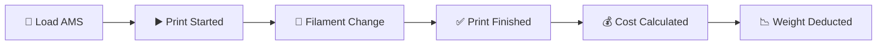

# User Story: Print Job Lifecycle

> From loading the AMS to knowing what your print cost.

## Overview



## Step 1: Load Filament into AMS

1. Open the **AMS** tab — shows all 6 slots:
   - AMS (4 slots)
   - AMS HT (1 slot)
   - External spool holder (1 slot)
2. Click **"+ Load"** on an empty slot
3. The spool picker opens — search by name, material, or color
4. Select a spool — it moves from storage to the AMS slot
5. The storage rack updates automatically (slot is now empty)

## Step 2: Print Started

When the Bambu Lab printer starts a print, Home Assistant detects the state change and sends a webhook:

```
POST /api/v1/events/print-started
{
  "printer_id": "...",
  "name": "Sensor Housing v3",
  "gcode_file": "sensor_housing_v3.3mf",
  "ha_event_id": "ha_event_12345",
  "print_weight": 45.2
}
```

The app:
- Creates a print record with status "running"
- Dashboard shows "Printing" (teal) instead of "Idle" (green)
- Idempotent: sending the same `ha_event_id` twice returns "already_exists"

## Step 3: Filament Change (Multi-Material)

If the print uses multiple filaments, HA reports each swap:

```
POST /api/v1/events/filament-changed
{
  "ha_event_id": "ha_event_12345",
  "old_spool": { "spool_id": "...", "weight_used": 25.3 },
  "new_tray": { "tag_uid": "8B119623B9CC0100" }
}
```

The app:
- Records usage for the old spool (25.3g deducted)
- Matches the new spool by RFID (confidence: 1.0)
- Calculates cost for the used filament

## Step 4: Print Finished

```
POST /api/v1/events/print-finished
{
  "ha_event_id": "ha_event_12345",
  "status": "finished",
  "usage": [{ "spool_id": "...", "weight_used": 19.9 }]
}
```

The app:
- Deducts remaining weight from each spool
- Calculates total cost based on purchase price per gram
- Updates spool status to "empty" if weight reaches 0
- Dashboard updates: cost added to monthly total

## Step 5: View Results

- **Dashboard**: "Filament Costs" card shows updated monthly total
- **Print History** tab: new entry with filament usage, weight, cost
- **Spool Detail** page: usage history shows this print
- **Spool History** tab: timeline entry "Used 45.2g for Sensor Housing v3"

## Failed Prints

When a print fails, HA sends status "failed":
- Weight is still deducted (filament was consumed)
- Print shows with ✗ icon and strikethrough in history
- Notes field captures the failure reason
- Cost is tracked but shown in muted text

## Cost Tracking

Each spool knows its purchase price. Cost per gram = purchase price / initial weight.

| Print | Filament | Weight | Cost |
|-------|----------|--------|------|
| Sensor Housing v3 | ABS-GF Gray | 25.3g | 0.76€ |
| Sensor Housing v3 | PLA Matte Charcoal | 19.9g | 0.40€ |
| **Total** | | **45.2g** | **1.16€** |
