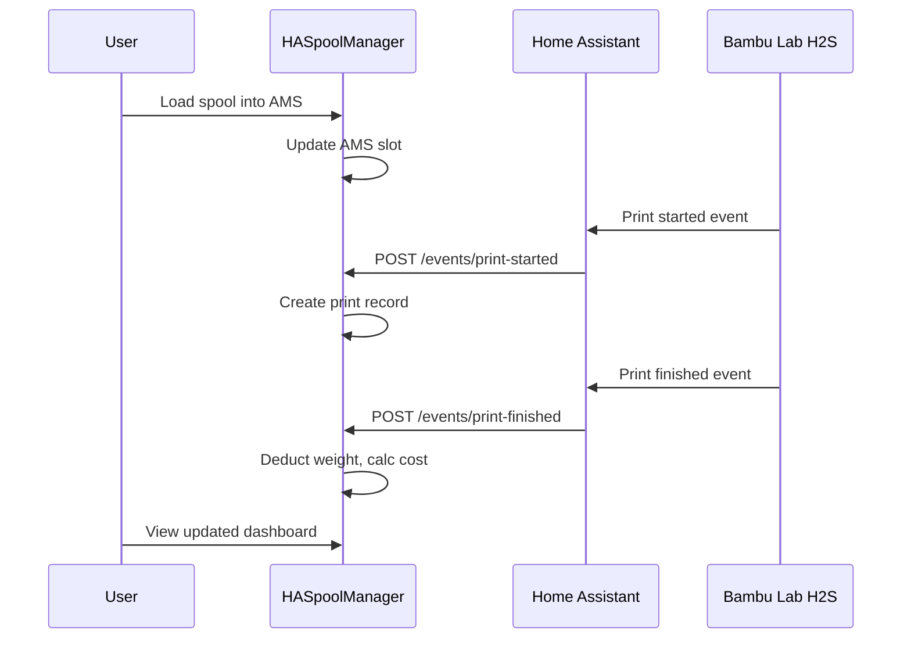

# User Story: Print Job Lifecycle

> From loading filament to tracking costs — what happens when you print.

## Overview

## Step 1: Load Filament into AMS

1. Pick a spool from your rack (Storage tab)
2. Physically load it into your Bambu Lab AMS
3. Two things happen:
   - **Automatic (RFID):** If it's a Bambu Lab spool with RFID, the printer reads the tag. HA fires `ams-slot-changed` → app identifies the spool via RFID match (confidence 1.0)
   - **Manual:** Go to AMS tab → click "Load" on the empty slot → pick the spool from the list

## Step 2: Start Printing

1. Start a print from Bambu Studio or the printer
2. Home Assistant detects the state change
3. HA sends `POST /api/v1/events/print-started` with:
   - Printer ID
   - Print name (from gcode file)
   - Estimated weight
   - `ha_event_id` (for idempotency)
4. App creates a print record with status "running"

## Step 3: Print Completes

1. Printer finishes (or fails)
2. HA sends `POST /api/v1/events/print-finished` with:
   - Status: finished/failed/cancelled
   - Usage: which spools, how much weight used
3. App processes:
   - Deducts weight from each spool used
   - Calculates filament cost (weight × price per gram)
   - Updates spool status (marks as "empty" if weight reaches 0)
   - Records everything in print history

## Step 4: View Results

- **Dashboard:** Updated stats — print count, monthly cost, remaining weight
- **Spool Detail:** Usage history shows the print with weight and cost
- **Print History:** Full log of all prints with status icons

## Matching Engine

How does the app know which spool was used?

### Tier 1a: RFID Exact Match (Confidence: 1.0)
Bambu Lab spools have RFID tags. The tag UID is unique to each spool.

### Tier 1b: Bambu Index Match (Confidence: 0.95)
The printer reports `tray_info_idx` (e.g., "GFA00" = PLA Basic). Combined with AMS slot position, this gives a near-certain match.

### Tier 2: Fuzzy Match (Scored)
For third-party spools without RFID:
- Bambu filament index: 40 points
- Material type match: 20 points
- CIE Delta-E color distance: 25 points
- Vendor name match: 10 points
- AMS location bonus: 5 points

## Multi-Material Prints

When a print uses multiple filaments:
1. App records usage for each spool separately
2. `filament-changed` webhook fires on each swap
3. Cost is the sum of all filaments used
