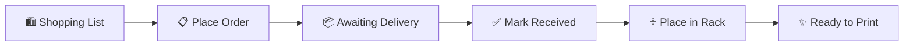

# User Story: Filament Procurement

> From browsing the shop to spools on the rack — the complete purchase lifecycle.

## Overview



## Step 1: Build a Shopping List

You need more PLA and PETG. Open the **Orders** tab.

1. The **Shopping List** section is at the top
2. Click **"+ Add Filament"**
3. Search for "PLA Matte" — the app shows all known PLA Matte filaments with color dots
4. Click to add — it appears in your shopping list with:
   - **Last price** you paid (from order history)
   - **Average price** across all purchases
   - **Current shop price** (crawled from the product page)
   - Price comparison: ↓ Below average (green) or ↑ Above average (red)
5. Adjust quantity (e.g., ×2)
6. Repeat for other filaments you need

**Estimated total** at the bottom tells you what to expect.

## Step 2: Place the Order

1. Open the shop link ("Open Shop ↗") — takes you directly to the product page
2. Buy the filaments from the shop (Bambu Lab Store, 3DJake, etc.)
3. When you get the order confirmation email, come back to the app
4. Click **"+ Add Order"** (or "Mark as Ordered" from the shopping list)
5. Paste the order confirmation email text into the text area
6. Click **"Parse"** — the AI extracts:
   - Shop name, order number, date
   - Each filament: name, vendor, material, color, weight, quantity, price
   - Matches against known filaments (green ✓ = known, amber "new" = first time)
7. Review and edit if needed
8. Click **"Create Order"**

The order appears in **"Awaiting Delivery"** with an amber badge.

## Step 3: Receive the Delivery

Package arrives at your door.

1. Open **Orders** tab — your order shows in "Awaiting Delivery"
2. Click **"Mark Received ✓"**
3. The **Receive Wizard** opens — guides you spool by spool:
   - "Place **Bambu Lab PLA Matte Charcoal** — Spool 1 of 4"
   - Shows the mini rack grid with empty slots highlighted in teal
   - Tap an empty slot → spool assigned to `R2-S5`
   - If rack is full → "Store in Surplus" button
4. Repeat for each spool
5. After all placed → "All 4 spools placed!" → Done

The order moves to **"Past Orders"** grouped by month.

## Step 4: Spools are Ready

Your new spools are now:
- Visible in the **Storage** page at their rack positions
- Searchable in the **Spools** inventory with filters
- Available in the spool picker when loading AMS slots
- Tracked with purchase price for cost analytics

## Example: Complete Flow

```
Email pasted: "Ihre Bestellung ist unterwegs
  PLA Basic × 1, Pink (10203) / Nachfüllung / 1 kg
  ABS × 2, Nachfüllung
  PLA Matte × 2, Kohlschwarz (11101) / Nachfüllung"

AI extracts:
  → Bambu Lab PLA Basic Pink × 1 (matched ✓)
  → Bambu Lab ABS × 2 (new)
  → Bambu Lab PLA Matte Charcoal Black × 2 (matched ✓)

After receiving:
  → PLA Basic Pink placed at R1-S4
  → ABS #1 placed at R2-S7
  → ABS #2 placed at R2-S8
  → PLA Matte #1 placed at R3-S1
  → PLA Matte #2 → Surplus (rack full)
```
