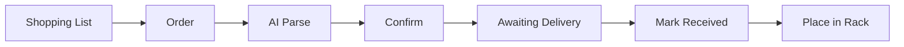

# User Story: Filament Procurement

> From shopping list to spool on the rack — the complete purchasing workflow.

## Overview

## Step 1: Build a Shopping List

You're running low on PLA Matte Charcoal and need more PETG for an upcoming project.

1. Go to **Orders** tab
2. In the **Shopping List** section, click **"+ Add Filament"**
3. Search for "Charcoal" → select **Bambu Lab PLA Matte Charcoal**
4. Set quantity to 2
5. The app shows:
   - **Last price:** 22.99€ (what you paid last time)
   - **Average price:** 21.50€ (across all purchases)
   - **Current shop price:** 11.50€ (crawled from eu.store.bambulab.com)
   - **Price indicator:** ↓ Below average (green)
6. Click **"Open Shop"** → opens Bambu Lab Store in a new tab
7. Add more filaments to the list as needed
8. **Estimated total** shows at the bottom

## Step 2: Place the Order

You've decided to order from Bambu Lab Store.

1. Order on the Bambu Lab website
2. After ordering, you receive a confirmation email
3. In HASpoolManager, click **"+ Add Order"** (top bar)
4. **Paste the order confirmation email** into the text area
5. Click **"Parse"** → AI extracts:
   - Shop: Bambu Lab
   - Order number: EN705479149380440065
   - Line items: PLA Matte Charcoal ×2, PETG HF Gray ×1
   - Prices per item
6. **Review** the parsed data — edit if needed
7. Click **"Create Order"**
8. Order appears in **"Awaiting Delivery"** section

## Step 3: Receive the Order

The package arrives a few days later.

1. Go to **Orders** tab
2. Your order shows in **"Awaiting Delivery"** with a teal border
3. Click **"Mark Received ✓"**
4. The **Receive Wizard** guides you spool by spool:
   - "Place **PLA Matte Charcoal** — Spool 1 of 3"
   - Shows the rack grid with empty slots highlighted
   - Tap an empty slot → spool placed at that position
   - If rack is full → click "Store in Surplus"
5. After all spools placed:
   - Order moves to **"Past Orders"**
   - Spools appear in the **Storage** rack
   - Dashboard stats update

## Step 4: Track Costs

Your purchase history grows over time:
- **Spool Detail** page shows purchase info with shop link
- **Shopping List** compares current prices vs your historical average
- **Dashboard** shows monthly filament costs
