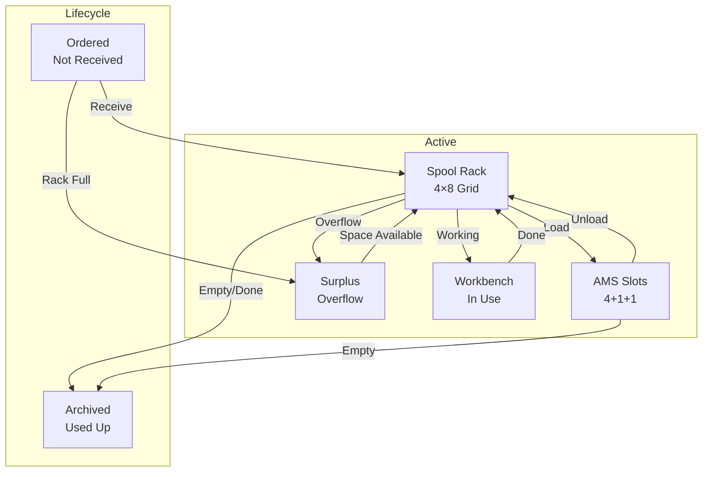

# User Story: Spool Management

> Organizing your filament inventory — rack, surplus, workbench, and archive.

## The Location System

## The Spool Rack (Digital Twin)

Your physical spool rack holds 4 rows × 8 columns = 32 spools. The app mirrors this exactly.

### Viewing the Rack
- Go to **Storage** tab
- See a grid with row headers (R1-R4) and column headers (S1-S8)
- Each occupied cell shows:
  - Filament color dot
  - Material abbreviation
  - Stock level indicator (green/amber/red)
- Empty cells show a "+" icon

### Moving Spools
Click any occupied cell → context menu appears:
- **View Details** — opens spool detail sheet
- **Move to Surplus** — moves to surplus section
- **Move to Workbench** — moves to workbench (e.g., currently using)
- **Archive** — soft-deletes the spool

### Drag & Drop (Desktop)
Drag a spool from one cell to another:
- If target is empty → spool moves there
- If target is occupied → spools swap positions

## Surplus Storage

When the rack is full, extra spools go to surplus.
- Shown below the rack grid
- Same card style as AMS slots
- Context menu: View Details, Move to Workbench, Move to Rack, Archive

## Workbench

For spools currently in active use (e.g., on your desk, next to the printer).
- Shown below surplus
- Same card style
- Context menu: View Details, Move to Surplus, Move to Rack

## Archiving Spools

When a spool is empty or no longer needed:

### Archive from Anywhere
- Rack cell → "Archive"
- Surplus/workbench card → "Archive"
- AMS slot → unloads and archives
- Spool detail page → "Archive" button

### View Archived Spools
1. Go to **Spools** tab
2. Set Status filter to **"Archived"**
3. See all archived spools with:
   - Checkbox for bulk selection
   - "Restore" button (moves to surplus)
   - "Delete" button (permanent)

### Mass Cleanup
1. Filter archived spools by Material or Vendor
2. Click "Select All" checkbox
3. Click "Delete X" → confirmation → permanently removed

## Weight Adjustment

If something goes wrong (print failed, spool broke):
1. Open any spool detail (from rack, AMS, spools list)
2. Click the pencil icon next to the remaining weight
3. Type the new weight
4. Press Enter or click ✓
5. Toast confirms: "Weight updated to 450g"
