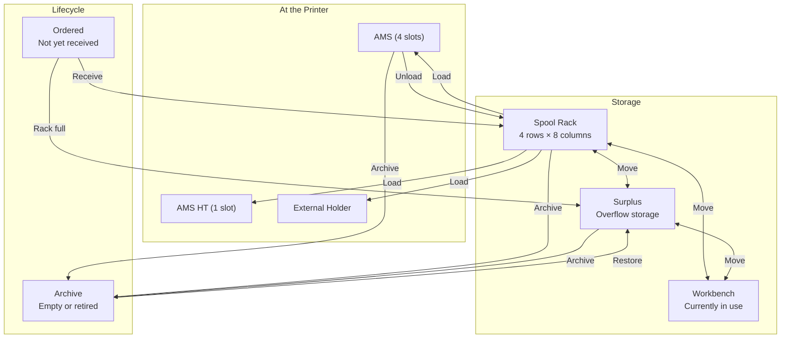

# User Story: Spool Management

> Organize, track, and manage your entire filament inventory.

## Locations

Every spool has exactly one location:

## The Spool Rack

Your physical spool rack is a 4×8 grid. The app mirrors it exactly.

### Placing Spools
- Each grid cell shows the filament color dot, material abbreviation, and a stock-level indicator (green/amber/red)
- Empty cells show "+" — click to assign a spool from inventory
- Drag & drop between cells to rearrange

### Context Menu
Click any occupied cell to see options:
- **View Details** — opens spool detail sheet
- **Move to Surplus** — when you need the slot for something else
- **Move to Workbench** — currently working with this spool
- **Archive** — spool is empty or no longer needed

## Surplus Storage

For spools that don't fit in the rack (you ordered 4 white PLA but only have 2 rack slots):
- Shows below the rack grid as a list
- Each card has a context menu: View Details, Move to Workbench, Move to Rack
- "Move to Rack" opens a slot picker — tap an empty cell to assign

## Workbench

Spools you're actively using but not in the AMS:
- Testing a new filament
- Manually feeding through the external holder
- Drying before loading into AMS

## Adjusting Weight

Sometimes the tracked weight doesn't match reality:
- You removed filament manually
- A print failed and you trimmed the spool
- The initial weight was wrong

On any spool detail page or sheet:
1. Click the ✏️ pencil icon next to the weight
2. Enter the new weight
3. Press Enter or click ✓
4. Toast: "Weight updated to 750g"

## Archiving Spools

When a spool is empty or no longer needed:
1. Click "Archive" from any context menu (rack, AMS, surplus, workbench, detail page)
2. Spool moves to the archive with `status: archived`
3. Disappears from all active views

### Viewing the Archive
1. Go to **Spools** tab
2. Set Status filter to **"Archived"**
3. See all archived spools with checkboxes

### Bulk Cleanup
1. Filter archived spools (optionally by material, vendor)
2. Click "Select All" checkbox
3. Click "Delete 12" to permanently remove
4. Confirmation dialog prevents accidents

### Restoring
Changed your mind? Click "Restore" — spool returns to surplus.

## Spool Filters

The Spools page has labeled filters:
- **Search** — by name, vendor, material
- **Material** — PLA, PETG, ABS, ABS-GF, TPU
- **Vendor** — Bambu Lab, Polymaker, Sunlu, etc.
- **Color** — dropdown with color dots
- **Status** — Active, Low Stock, Empty, Archived
- **View** — toggle between grid cards and data table
